# Domain Configuration

## Executive Summary

This document describes the implementation of the custom domain **probryx.org** within Microsoft 365 Business Premium.

---

## Business Requirement

Probryx Technologies requires a professional custom domain for Microsoft 365 identities, email, Teams, SharePoint, and OneDrive.

---

## Objectives

- Verify domain ownership
- Configure DNS
- Enable Microsoft 365 services
- Set default domain
- Validate deployment

---

## Prerequisites

- Microsoft 365 Business Premium Tenant
- Global Administrator
- Domain ownership
- DNS access

---

## Implementation Overview

|Task|Status|
|---|:---:|
|Review default domain|✅|
|Add domain|✅|
|Verify ownership|✅|
|Configure DNS|✅|
|Validate|✅|

---

## Configuration Steps

### Step 1 - Review Existing Domain

Screenshot:

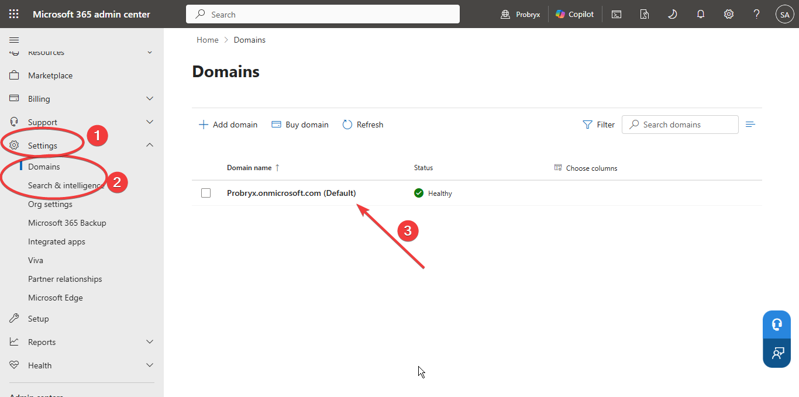

### Step 2 - Add Custom Domain

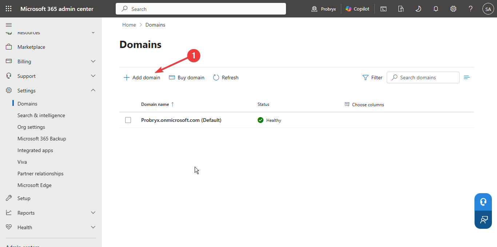
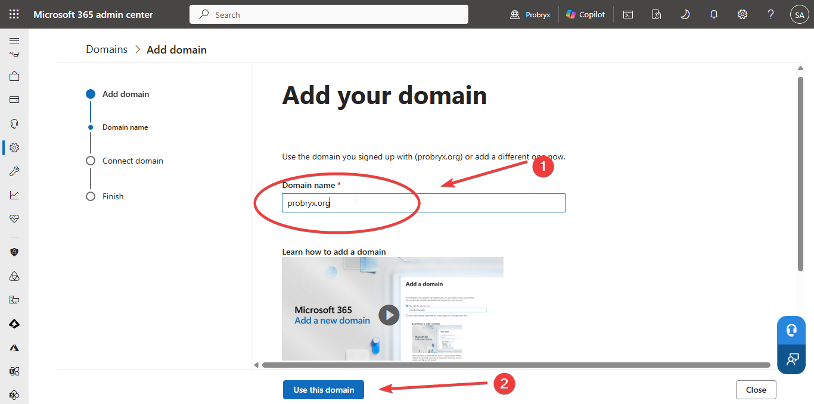

### Step 3 - TXT Verification

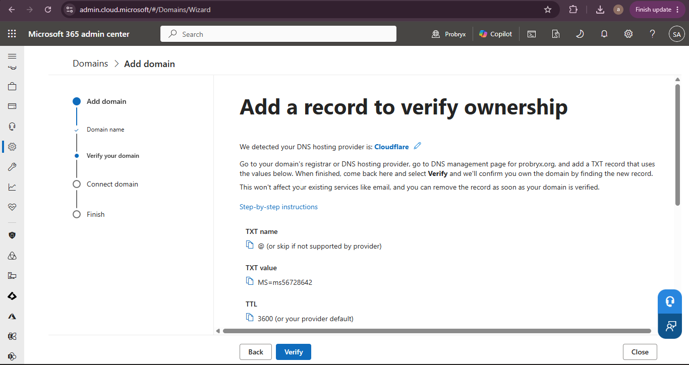
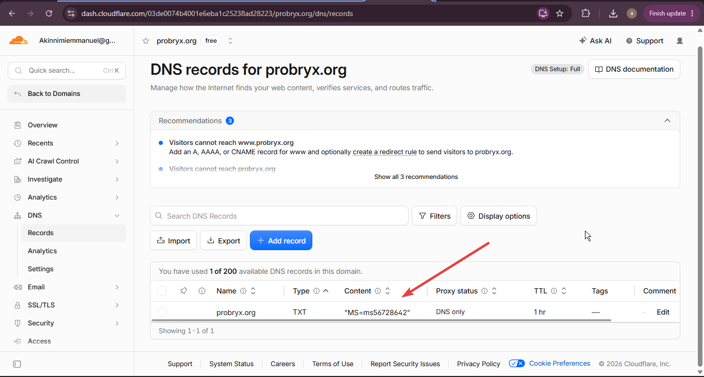

### Step 4 - Domain Verified

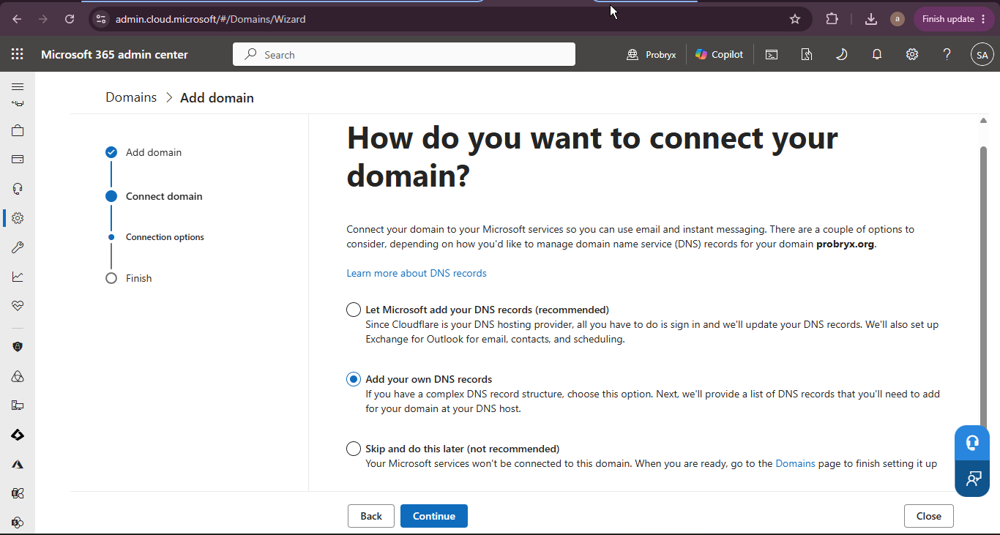

### Step 5 - Configure DNS Records

|Record|Purpose|Screenshot|
|---|---|---|
|MX|Mail Routing|05-mx-record.png|
|TXT (SPF)|Email Authentication|06-spf-record.png|
|Autodiscover|Outlook|07-autodiscover.png|
|Enterprise Enrollment|Device Enrollment|08-enterprise-enrollment.png|
|Enterprise Registration|Device Registration|09-enterprise-registration.png|

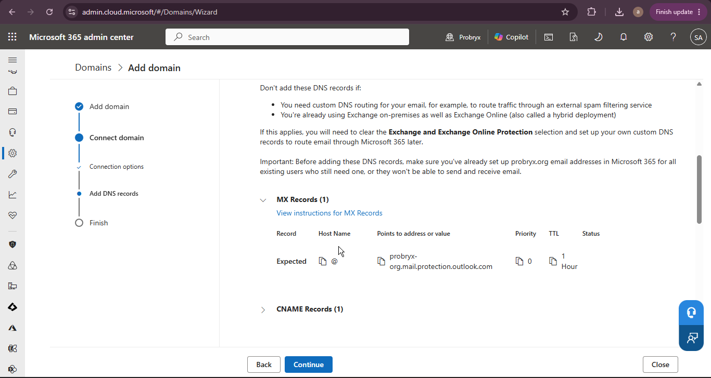

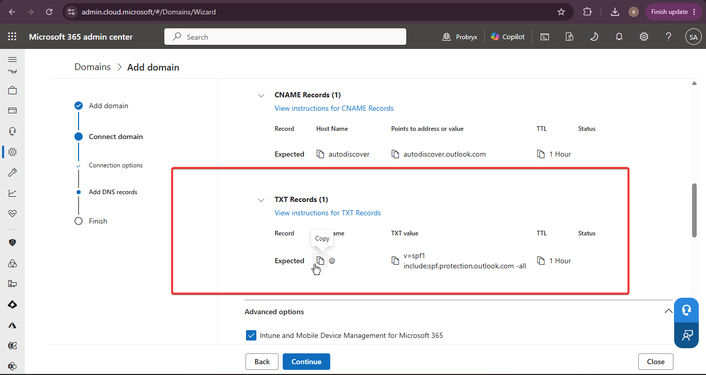

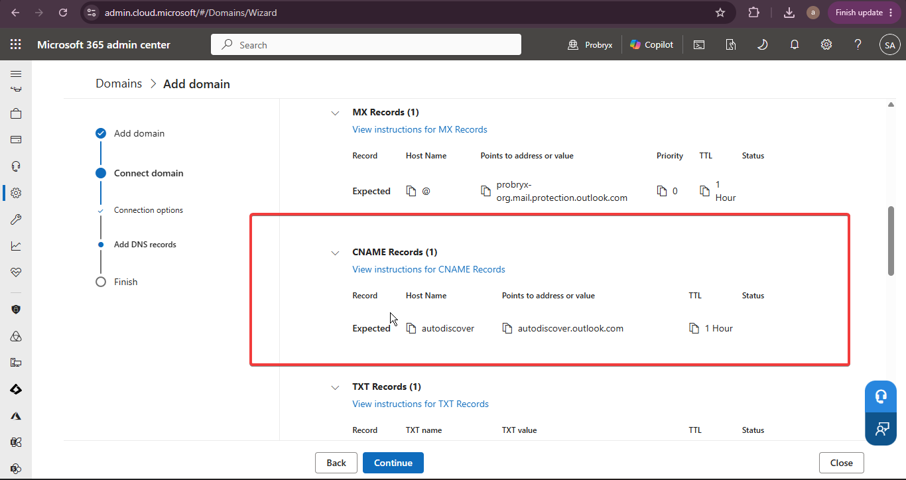

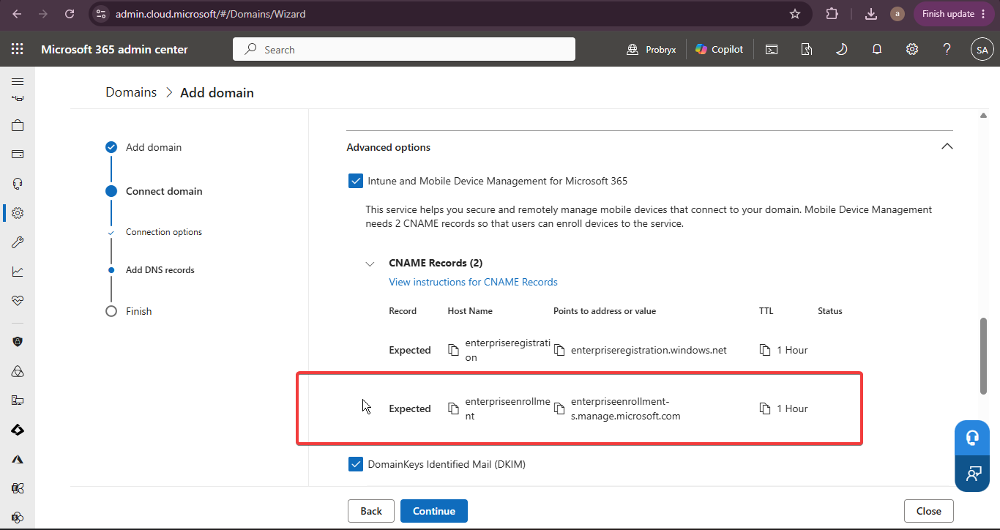

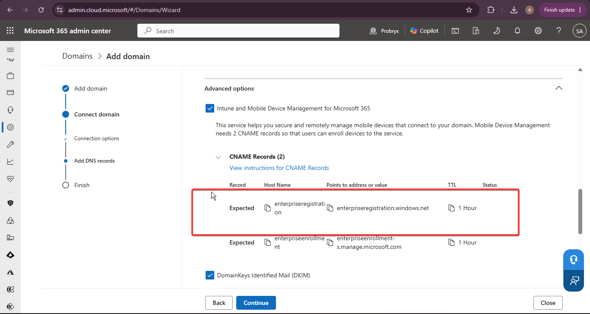

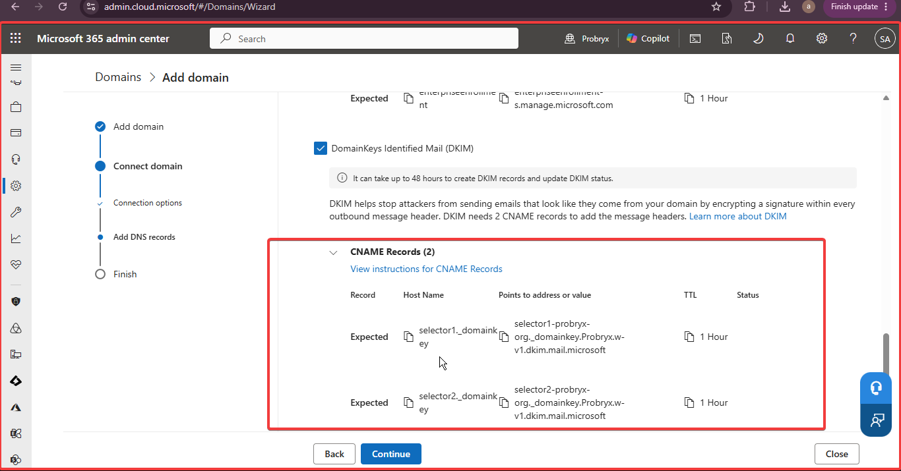

### All Records added to the cloudflare domain
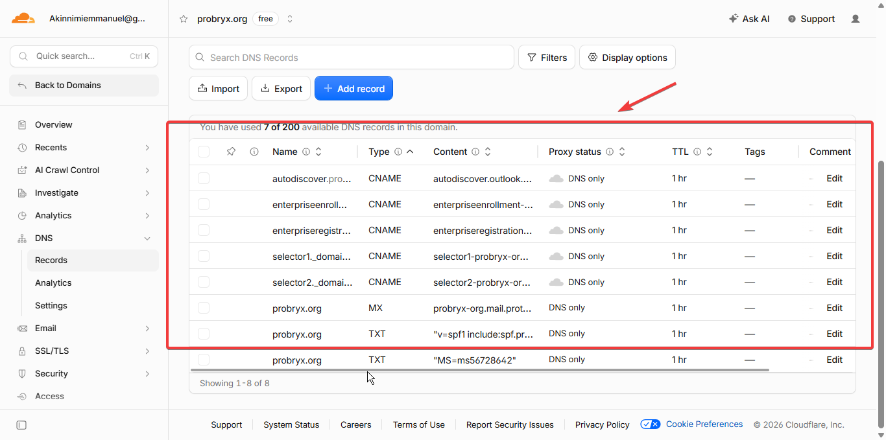

### Domain setup complete
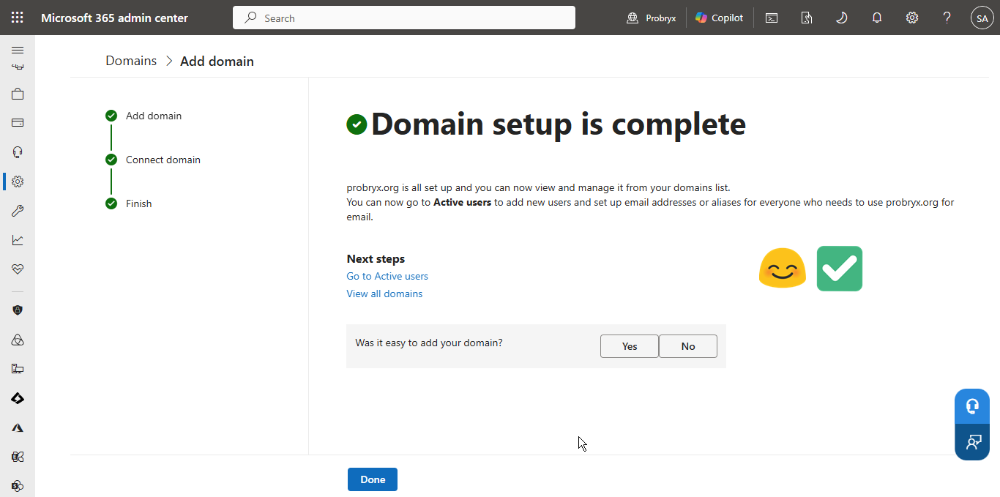

### Step 6 - Domain Healthy

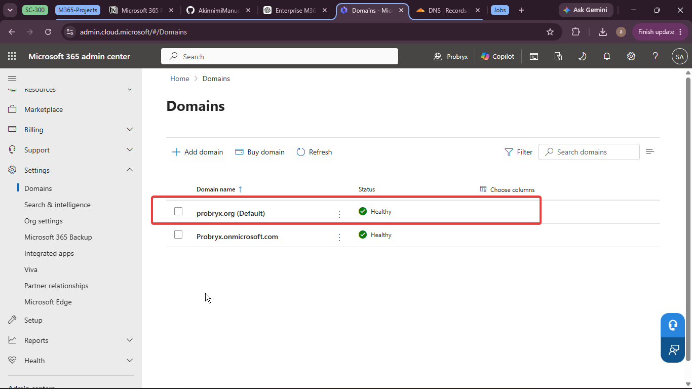

### Step 7 - Default Domain

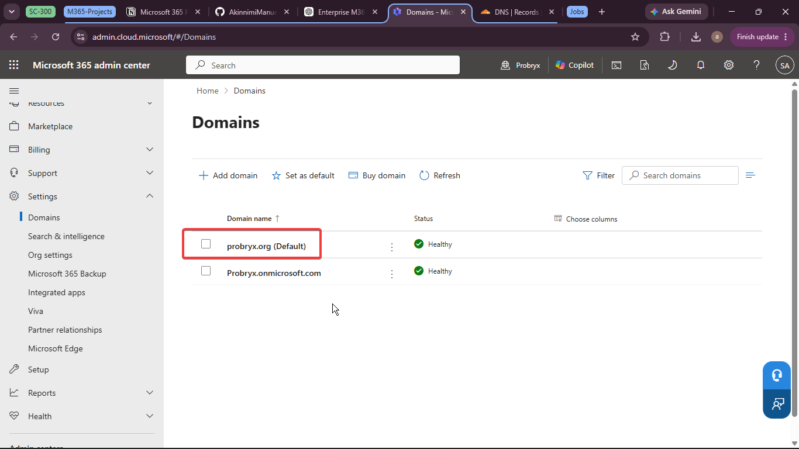

### Step 8 - Verify User UPN

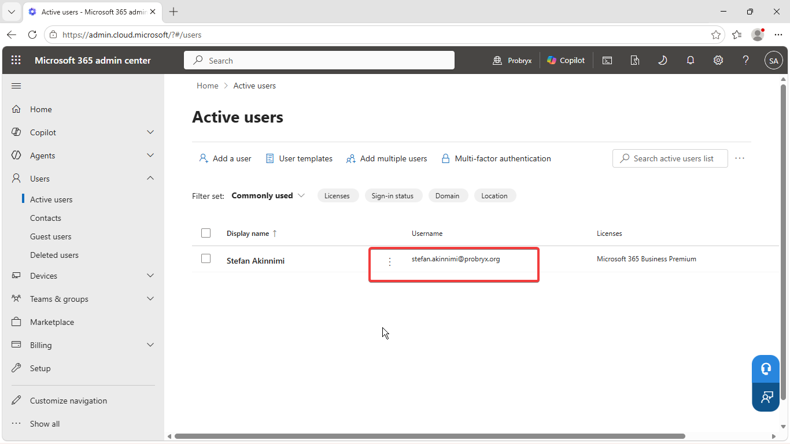

### Step 9 - Exchange Accepted Domain

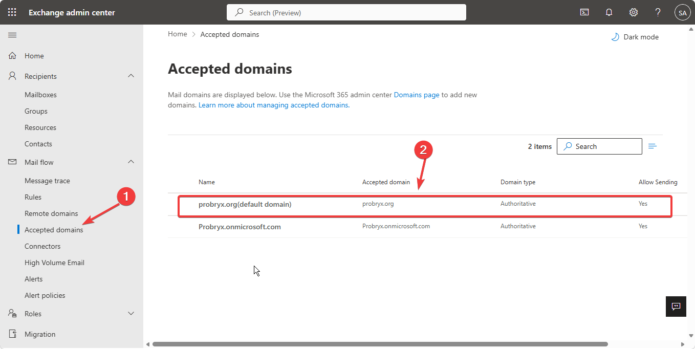

---

## Technical Explanation

Why These DNS Records Are Required

When adding a custom domain to Microsoft 365, DNS records verify domain ownership and direct Microsoft 365 services to work correctly.

TXT (Verification): Confirms you own the domain before it can be added to Microsoft 365.
MX: Routes incoming email to Exchange Online.
SPF (TXT): Authorizes Microsoft 365 to send email on behalf of your domain, helping prevent spoofing.
Autodiscover (CNAME): Automatically configures Outlook clients.
EnterpriseEnrollment (CNAME): Enables automatic Microsoft Intune device enrollment.
EnterpriseRegistration (CNAME): Supports Microsoft Entra ID device registration and Azure AD Join.
DKIM (CNAME): Digitally signs outgoing emails to improve security and deliverability.
DMARC (TXT): Specifies how to handle emails that fail authentication, protecting against phishing.

---

## Validation

- Domain verified ✅
- DNS configured ✅
- Domain healthy ✅
- Default domain changed ✅
- UPN updated ✅
- Exchange recognizes domain ✅

---

## Troubleshooting

|Issue|Cause|Resolution|
|---|---|---|
|Domain verification delay|DNS propagation|Wait and retry before it propagated|
---

## Lessons Learned

- All Reocords are important for effective Microsoft tennat.

---

## References

- Microsoft Learn - Microsoft 365 Custom Domains
- Microsoft Learn - Exchange Online DNS Records

## Navigation

⬅️ Previous: [Project Planning](01-Project-Planning.md)

🏠 Project Home: [../README.md](../README.md)

➡️ Next: [Tenant Configuration](03-Tenant-Configuration.md)