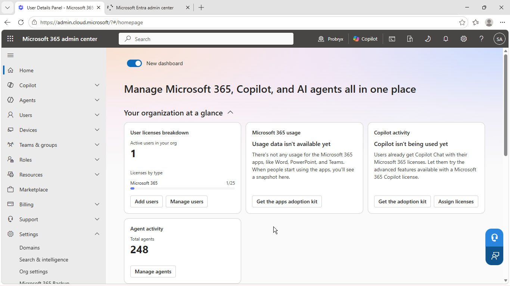
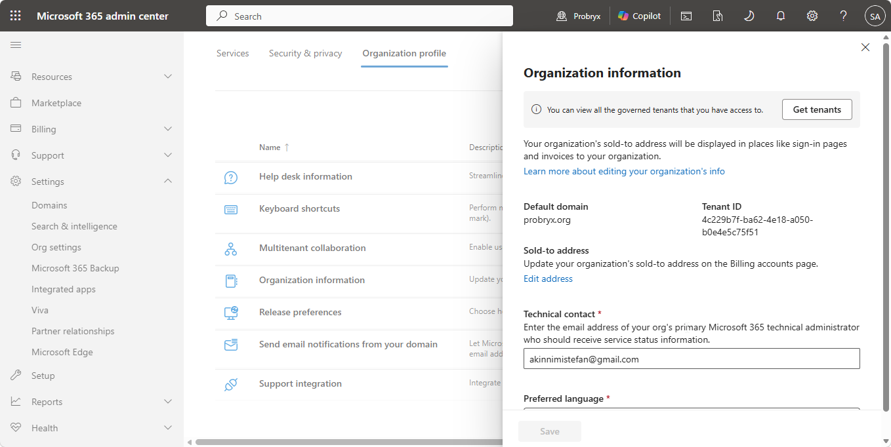
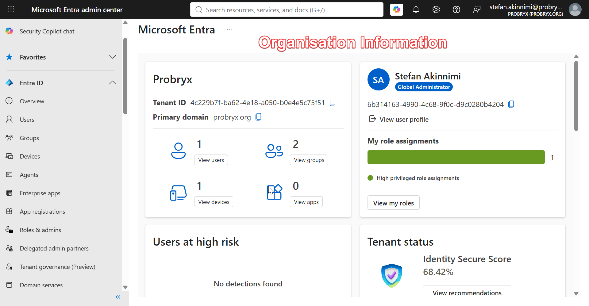
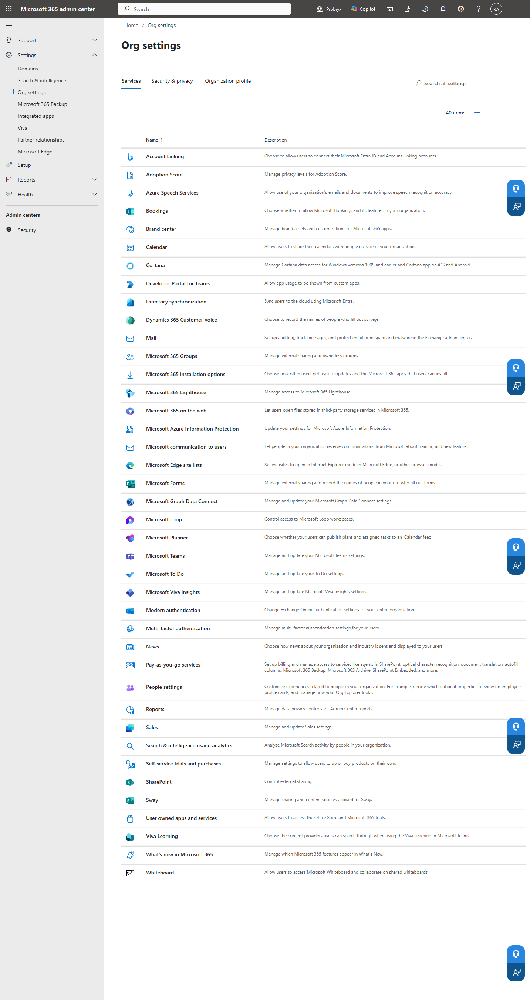
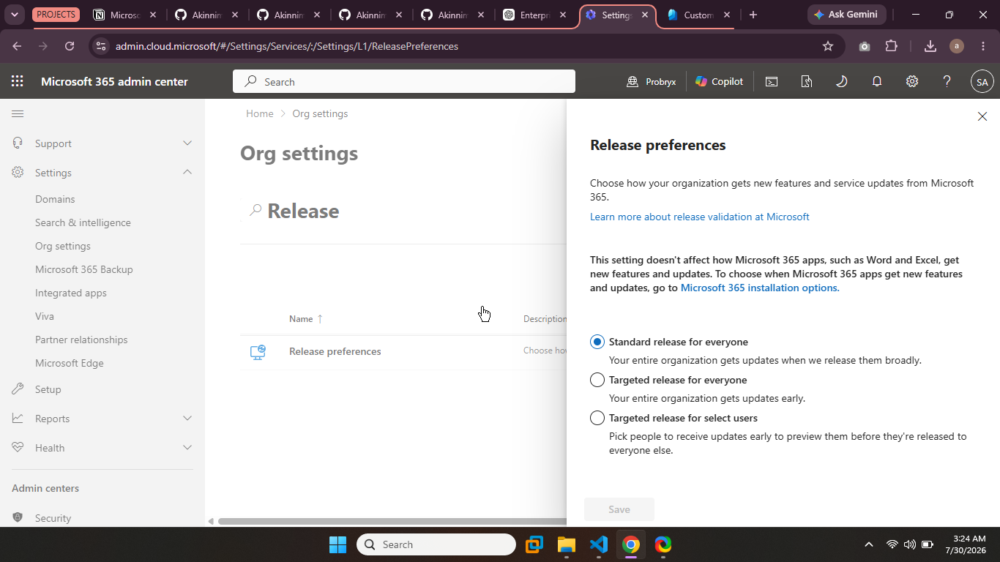
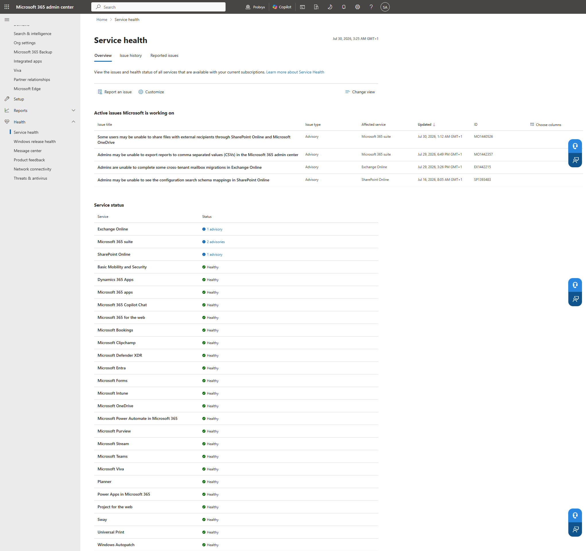
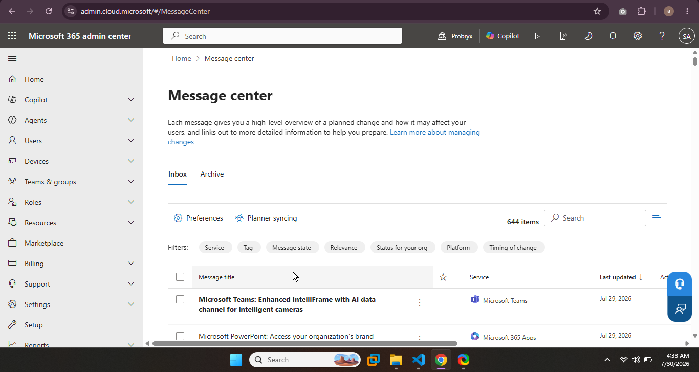

# Tenant Configuration

> **Project:** Enterprise Microsoft 365 Deployment  
> **Company:** Probryx Technologies Ltd.  
> **Phase:** Tenant Configuration  
> **Environment:** Microsoft 365 Business Premium

---

# 1. Executive Summary

This document describes the initial configuration of the Microsoft 365 tenant for Probryx Technologies Ltd. The objective of this phase is to prepare the tenant for enterprise deployment by configuring organizational settings, reviewing administrative portals, validating tenant health, and documenting the baseline configuration before user provisioning begins.

---

# 2. Business Requirement

Probryx Technologies requires a properly configured Microsoft 365 tenant that reflects the organization's identity and provides a stable foundation for identity management, collaboration, messaging, and security.

A correctly configured tenant ensures consistency, simplifies administration, and prepares the environment for future projects such as Microsoft Intune, Zero Trust Security, and Hybrid Identity.

---

# 3. Objectives

- Configure organizational information
- Verify Microsoft 365 subscription
- Configure organization profile
- Review organization settings
- Configure release preferences
- Review service health
- Review Message Center
- Verify available admin centers
- Review Security Defaults
- Document the tenant baseline

---

# 4. Prerequisites

- Microsoft 365 Business Premium
- Global Administrator account
- Custom domain successfully configured
- Internet connectivity

---

# 5. Implementation Overview

| Task | Status |
|------|:------:|
| Microsoft 365 Admin Center Reviewed | ✅ |
| Organization Profile Configured | ✅ |
| Company Branding Reviewed | ✅ |
| Organization Information Verified | ✅ |
| Organization Settings Reviewed | ✅ |
| Release Preferences Configured | ✅ |
| Service Health Reviewed | ✅ |
| Message Center Reviewed | ✅ |
| Admin Centers Reviewed | ✅ |
| Security Defaults Reviewed | ✅ |

---

# 6. Configuration Steps

---

## Step 1 – Review Microsoft 365 Admin Center

Navigate to:

Microsoft 365 Admin Center

Review:

- Dashboard
- Navigation menu
- Tenant information
- Subscription

### Screenshot



---

## Step 2 – Configure Organization Profile

Navigate to:

Settings

↓

Org Settings

↓

Organization Profile

Configure:

- Company Name
- Country
- Language
- Time Zone

Recommended Values

| Setting | Value |
|----------|-------|
| Organization | Probryx Technologies Ltd. |
| Country | Nigeria |
| Language | English |
| Time Zone | UTC +01:00 West Central Africa |

### Screenshot




---

## Step 3 – Company Branding

Navigate to

Microsoft Entra Admin Center

↓

Identity

↓

Company Branding

Review or configure

- Company Name
- Banner Logo
- Square Logo
- Background Image
- Sign-in Text

If branding assets are unavailable, document this for future implementation.

### Screenshot

```
../screenshots/tenant/03-company-branding.png
```


---

## Step 4 – Organization Information

Verify:

- Tenant Name
- Tenant ID
- Initial Domain
- Custom Domain
- Subscription

### Screenshot

```
../screenshots/tenant/04-org-information.png
```



---

## Step 5 – Organization Settings

Review available organizational settings.

Examples include:

- Calendar
- Microsoft Loop
- Viva
- User-owned Apps
- Self-service Purchase

No changes are required unless necessary.

### Screenshot

```
../screenshots/tenant/05-org-settings.png
```



---

## Step 6 – Configure Release Preferences

Navigate to

Settings

↓

Org Settings

↓

Release Preferences

Recommended:

Standard Release

Reason:

Provides production stability while avoiding preview features.

### Screenshot

```
../screenshots/tenant/06-release-preferences.png
```



---

## Step 7 – Review Service Health

Navigate to

Health

↓

Service Health

Review:

- Active Incidents
- Advisories
- Current Service Status

### Screenshot

```
../screenshots/tenant/07-service-health.png
```



---

## Step 8 – Review Message Center

Navigate to

Health

↓

Message Center

Review:

- Upcoming Changes
- Feature Releases
- Planned Maintenance

### Screenshot

```
../screenshots/tenant/08-message-center.png
```



---

## Step 9 – Review Available Admin Centers

Review available portals:

- Microsoft Entra
- Exchange
- Teams
- SharePoint
- Intune
- Security
- Compliance

### Screenshot

```
../screenshots/tenant/09-admin-centers.png
```


---

## Step 10 – Review Security Defaults

Navigate to

Microsoft Entra Admin Center

↓

Identity

↓

Overview

↓

Properties

↓

Manage Security Defaults

Record the current configuration.

This project only documents the current state.

Advanced security configuration will be completed during Project 3.

### Screenshot

```
../screenshots/tenant/10-security-defaults.png
```


---

## Step 11 – Tenant Summary

Return to Microsoft 365 Admin Center.

Capture a final screenshot showing:

- Organization Name
- Domain
- Subscription
- Overall Tenant Status

### Screenshot

```
../screenshots/tenant/11-tenant-summary.png
```


---

# 7. Technical Explanation

## Why configure the Organization Profile?

The organization profile identifies the Microsoft 365 tenant and provides business information used across Microsoft services.

---

## Why review Service Health?

Service Health enables administrators to monitor outages, advisories, and service degradation that may affect users.

---

## Why review Message Center?

The Message Center communicates upcoming Microsoft changes, feature releases, maintenance events, and retirement notices.

---

## Why configure Release Preferences?

Release Preferences determine how quickly users receive new Microsoft 365 features.

Standard Release is generally recommended for production environments.

---

## Why review Security Defaults?

Security Defaults provide a baseline level of protection including Multi-Factor Authentication and legacy authentication blocking.

---

# 8. Screenshots

| Screenshot | Description |
|------------|-------------|
| 01-admin-center-home.png | Microsoft 365 Admin Center Dashboard |
| 02-organization-profile.png | Organization Profile |
| 03-company-branding.png | Company Branding |
| 04-org-information.png | Organization Information |
| 05-org-settings.png | Organization Settings |
| 06-release-preferences.png | Release Preferences |
| 07-service-health.png | Microsoft Service Health |
| 08-message-center.png | Microsoft Message Center |
| 09-admin-centers.png | Available Admin Centers |
| 10-security-defaults.png | Security Defaults |
| 11-tenant-summary.png | Final Tenant Overview |

---

# 9. Validation

| Validation Item | Status |
|-----------------|:------:|
| Organization Profile Configured | ✅ |
| Organization Information Verified | ✅ |
| Company Branding Reviewed | ✅ |
| Organization Settings Reviewed | ✅ |
| Release Preferences Configured | ✅ |
| Service Health Reviewed | ✅ |
| Message Center Reviewed | ✅ |
| Admin Centers Accessible | ✅ |
| Security Defaults Documented | ✅ |

---

# 10. Troubleshooting

| Issue | Cause | Resolution |
|------|------|-----------|
| Company branding unavailable | Branding assets not prepared | Configure after branding is created |
| Release Preferences unavailable | Permission issue | Verify Global Administrator role |
| Service Health unavailable | Microsoft service issue | Retry later |

---

# 11. Lessons Learned

- A Microsoft 365 tenant should be configured before creating users.
- Organization settings establish consistency across Microsoft services.
- Service Health and Message Center should be monitored regularly.
- Standard Release provides a stable production experience.
- Documenting the baseline simplifies future troubleshooting and audits.

---

# 12. References

- Microsoft Learn – Microsoft 365 Admin Center
- Microsoft Learn – Microsoft Entra ID
- Microsoft Learn – Organization Settings
- Microsoft Learn – Service Health
- Microsoft Learn – Message Center

---

# Change Log

| Version | Date | Author | Description |
|----------|------|--------|-------------|
| 1.0 | YYYY-MM-DD | Emmanuel Stefan Akinnimi | Initial Tenant Configuration |

---