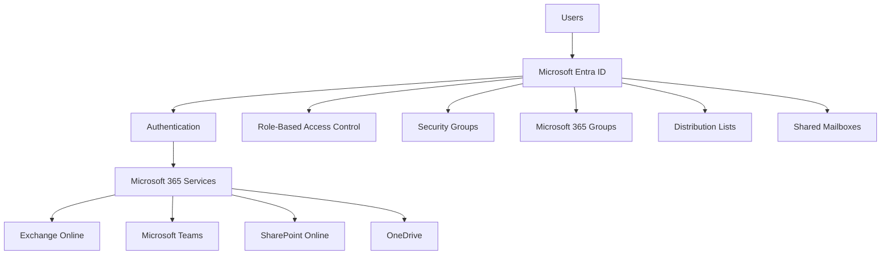
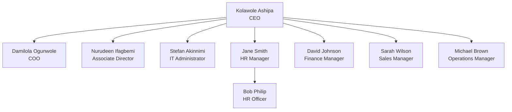
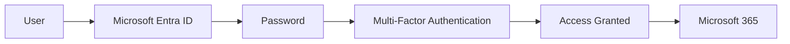
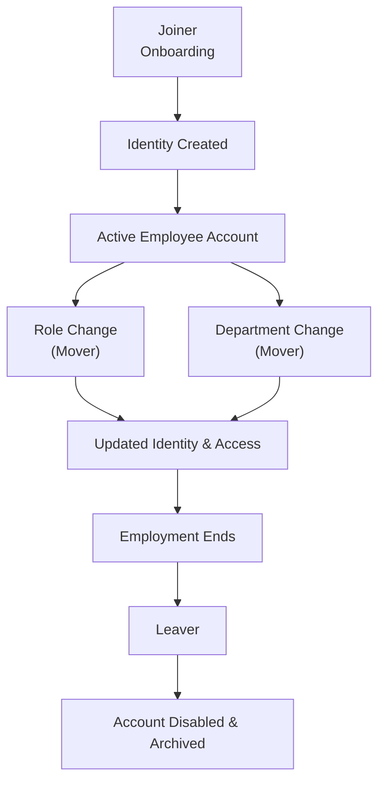

# Identity Architecture

---

# Business Requirement

A well-designed identity architecture provides the foundation for secure authentication, authorization, and access management across Microsoft 365 services. This document defines the logical identity design implemented for Probryx Technologies Ltd. and demonstrates how Microsoft Entra ID supports a secure and scalable cloud environment.

---

# Architecture Overview

The identity solution is built on Microsoft Entra ID as the centralized identity provider for Microsoft 365. All users authenticate through Entra ID, where access is governed by Role-Based Access Control (RBAC), Security Groups, Microsoft 365 Groups, and modern authentication methods.

The architecture follows Microsoft's Zero Trust principles by verifying identities, enforcing least privilege, and protecting user access with Multi-Factor Authentication (MFA).

---

# Identity Components

| Component | Purpose |
|----------|---------|
| Microsoft Entra ID | Central Identity Provider |
| Microsoft 365 Admin Center | User & License Administration |
| Exchange Online | Email Services |
| Security Groups | Resource Access Control |
| Microsoft 365 Groups | Collaboration |
| Distribution Lists | Organization-wide Email |
| Shared Mailboxes | Shared Department Communication |
| MFA | Strong Authentication |
| Self-Service Password Reset | Password Recovery |

---

# Identity Architecture Diagram

---

# Organizational Structure

---

# Administrative Role Architecture

| User | Administrative Role |
|------|----------------------|
| Kolawole Ashipa | Global Administrator |
| Stefan Akinnimi | Global Administrator |
| Jane Smith | User Administrator |
| All Other Users | Standard User |

### Technical Explanation

Administrative responsibilities are delegated using Microsoft Entra ID Role-Based Access Control (RBAC). This reduces security risk by ensuring users receive only the permissions required to perform their responsibilities.

---

# Identity Naming Standards

| Object | Standard |
|---------|----------|
| User Accounts | firstname.lastname@probryx.org |
| Security Groups | SG-Department |
| Microsoft 365 Groups | M365-Department |
| Distribution Lists | DL-Department |
| Shared Mailboxes | support@probryx.org |

---

# Authentication Flow

---

# Joiner • Mover • Leaver Lifecycle

---

# Department Access Model

| Department | Security Group | Microsoft 365 Group | Distribution List |
|------------|---------------|--------------------|-------------------|
| Executive | SG-EXECUTIVE | M365-EXECUTIVE | DL-Management |
| IT | SG-IT | M365-IT | DL-IT |
| HR | SG-HR | M365-HR | DL-HR |
| Finance | SG-FINANCE | M365-FINANCE | DL-FINANCE |
| Sales | SG-SALES | M365-SALES | DL-SALES |
| Operations | SG-OPERATIONS | M365-OPERATIONS | DL-OPERATIONS |

---

# Security Design Principles

The identity architecture follows these security principles:

- Least Privilege
- Role-Based Access Control (RBAC)
- Multi-Factor Authentication (MFA)
- Centralized Identity Management
- Group-Based Access Management
- Secure Identity Lifecycle Management

---

# Identity Standards

The following standards were adopted throughout the deployment:

- Consistent user naming conventions
- Department-based Security Groups
- Microsoft 365 Groups for collaboration
- Distribution Lists for communication
- Shared Mailboxes for business functions
- Delegated administration using RBAC
- Multi-Factor Authentication for privileged accounts

---

# Design Validation

The identity architecture was reviewed to ensure:

- Users authenticate through Microsoft Entra ID.
- Administrative access follows RBAC principles.
- Group-based access is implemented.
- Departmental collaboration is supported through Microsoft 365 Groups.
- Naming standards are applied consistently.
- Authentication is protected with MFA for privileged accounts.

---

# Lessons Learned

Designing the identity architecture before expanding Microsoft 365 services provides a secure and scalable foundation for future workloads. Standardized identities, group-based access, and delegated administration simplify management while supporting Zero Trust security principles.

---

# Conclusion

The identity architecture establishes Microsoft Entra ID as the central identity platform for Probryx Technologies Ltd. By combining standardized user identities, RBAC, group-based access control, and secure authentication, the organization has a scalable identity framework capable of supporting future Microsoft 365 workloads, including Exchange Online, Microsoft Teams, SharePoint Online, OneDrive, Intune, and Zero Trust security.

---

# References

- Microsoft Learn – Microsoft Entra ID
- Microsoft Learn – Identity and Access Management
- Microsoft Learn – Role-Based Access Control (RBAC)

---

## Navigation

⬅️ **Previous:** [Identity Groups](Identity-Groups.md)

🏠 **Identity Home:** [README.md](README.md)

➡️ **Next:** Licensing