# Identity Groups

> **Project:** Enterprise Microsoft 365 Deployment  
> **Company:** Probryx Technologies Ltd.

---

## Business Requirement

Modern organizations rely on groups to simplify access management, improve collaboration, and enforce security policies. Instead of assigning permissions directly to individual users, groups provide a scalable way to manage access to Microsoft 365 resources.

Probryx Technologies Ltd. implements a standardized group strategy using Microsoft Entra ID to improve administration, reduce operational overhead, and support future growth.

---

# Implementation Overview

This phase implements the organization's group strategy by configuring Security Groups, Microsoft 365 Groups, Distribution Lists, and Shared Mailboxes.

The deployment follows Microsoft's recommended best practices for access management, collaboration, and delegated administration.

---

# Objectives

- Implement standardized group naming conventions
- Configure Security Groups
- Deploy Microsoft 365 Groups
- Create Distribution Lists
- Configure Shared Mailboxes
- Assign group owners
- Validate group membership and access
- Document the enterprise group strategy

---

# Prerequisites

Before beginning this phase, I ensured the following requirements have been completed:

- Microsoft 365 Business Premium tenant
- Verified custom domain
- Microsoft Entra ID configured
- Administrative account
- Sample users created
- Identity Management phase completed

---

# Group Strategy

The following group types were implemented during this deployment.

| Group Type | Purpose |
|------------|---------|
| Security Group | Controls access to applications, SharePoint sites and resources. |
| Microsoft 365 Group | Provides collaboration features including Teams, Outlook, Planner and SharePoint. |
| Distribution List | Sends email to multiple recipients using a single address. |
| Shared Mailbox | Allows multiple users to manage a common mailbox without sharing passwords. |

---

# Naming Standards

The following naming convention was adopted throughout the deployment.

## Security Groups

```
SG-IT
SG-HR
SG-FINANCE
SG-SALES
SG-EXECUTIVE
```

---

## Microsoft 365 Groups

```
M365-EXECUTIVE
M365-IT
M365-HR
M365-FINANCE
M365-SALES
M365-Probryx
```

---

## Distribution Lists

```
DL-AllStaff
DL-Management
DL-HR
DL-IT
DL-FINANCE
DL-SALES
DL-OPERATIONS
```

---

## Shared Mailboxes

```
support@probryx.org
info@probryx.org
helpdesk@probryx.org
```

---

# Department Access Matrix

| Department | Security Group | Microsoft 365 Group | Distribution List |
|------------|---------------|--------------------|-------------------|
| IT | SG-IT | M365-IT | DL-IT |
| HR | SG-HR | M365-HR | DL-HR |
| Finance | SG-FINANCE | M365-FINANCE | DL-FINANCE |
| Sales | SG-SALES | M365-SALES | DL-SALES |
| Management | SG-MANAGEMENT | M365-MANAGEMENT | DL-Management |

---

# Configuration Steps

---

## Step 1 – Create Security Groups

Navigate to:

Microsoft Entra Admin Center

↓

Groups

↓

All Groups

↓

New Group

Create the required Security Groups for each department.

### Technical Explanation

Security Groups are used to manage access to organizational resources by assigning permissions to groups instead of individual users.

### Screenshot

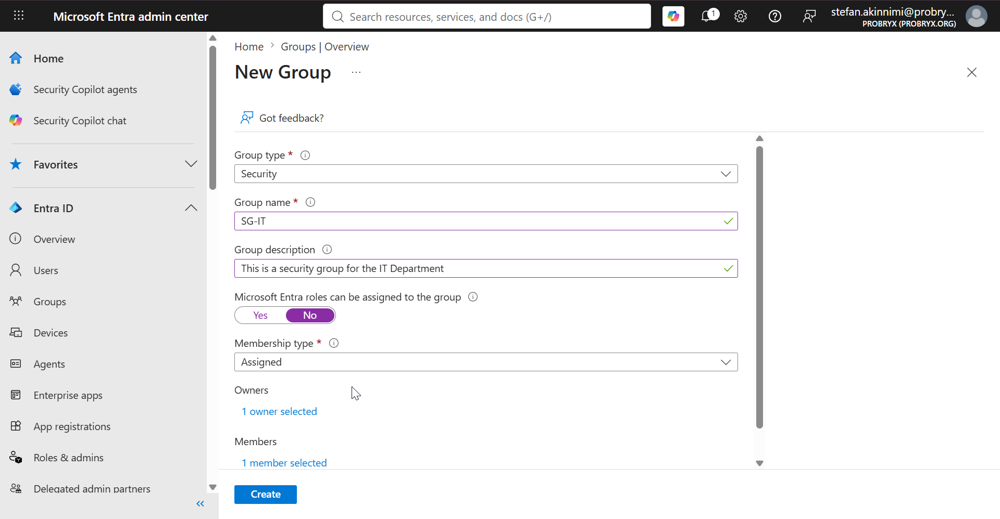

### All SG Created
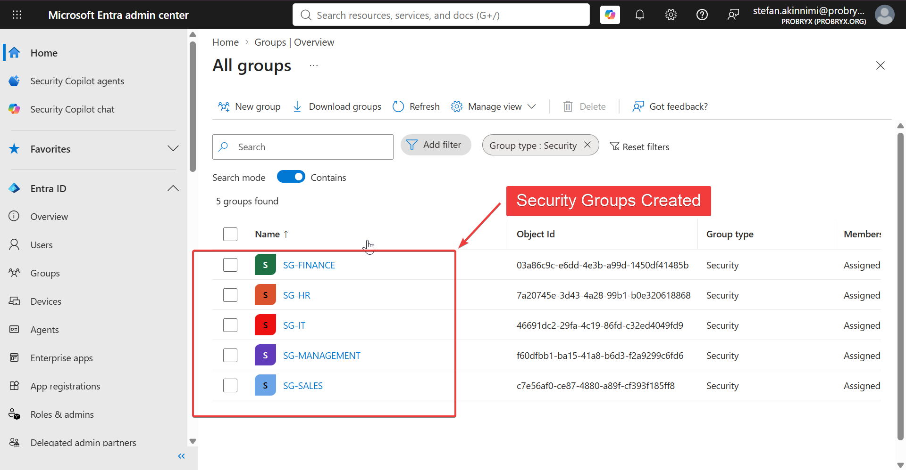

---

## Step 2 – Add Members to Security Groups

Assign users to the appropriate departmental Security Groups.

Example:

- Stefan Akinnimi → SG-IT
- Jane Smith → SG-HR
- Sarah Wilson → SG-SALES


### Technical Explanation

Adding users to groups centralizes permission management and reduces administrative effort when employees change roles.

### Screenshot

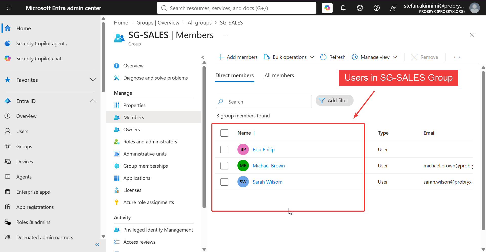

---

## Step 3 – Create Microsoft 365 Groups

Navigate to:

Microsoft Entra Admin Center

↓

Groups

↓

New Group

↓

Microsoft 365

Create collaboration groups for each department.

### Technical Explanation

Microsoft 365 Groups automatically provide shared resources including Outlook, Teams, SharePoint, Planner and OneNote.

### Screenshot

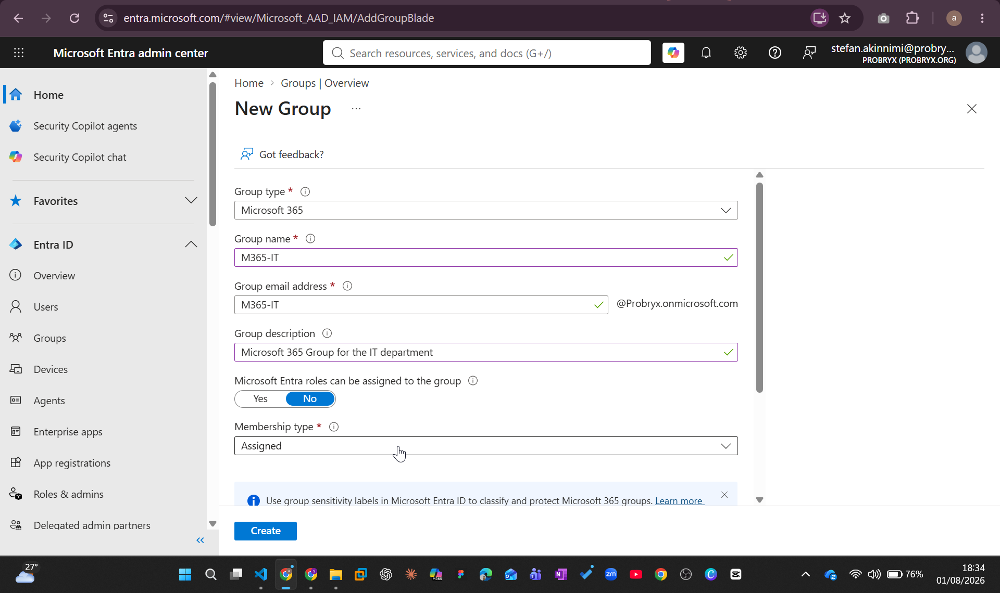


---

## Step 4 – Configure Group Owners

Assign an owner to each Microsoft 365 Group.

Example:

- IT Manager
- HR Manager
- Finance Manager

### Technical Explanation

Group owners are responsible for managing membership and maintaining the group's lifecycle.

### Screenshot

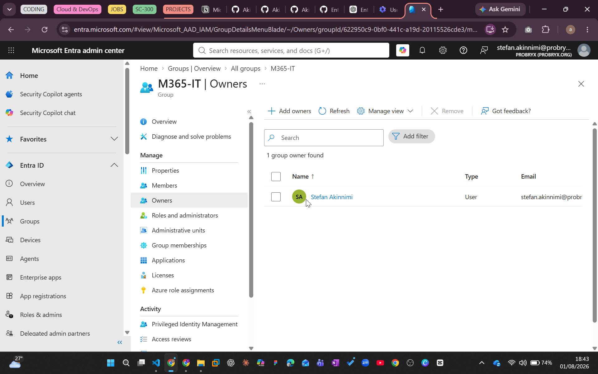

---

## Step 5 – Create Distribution Lists

Navigate to

Exchange Admin Center

↓

Recipients

↓

Groups

↓

Distribution List

Create email distribution lists for departments and company-wide announcements.

### Technical Explanation

Distribution Lists simplify email communication by allowing messages to be sent to multiple recipients using a single email address.

### Screenshot

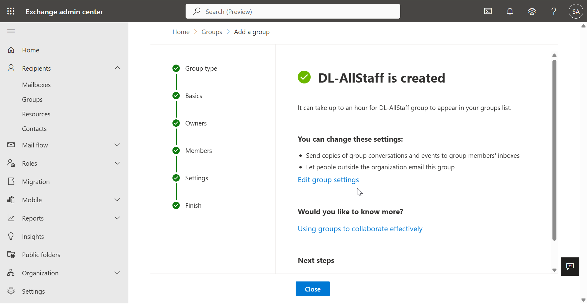

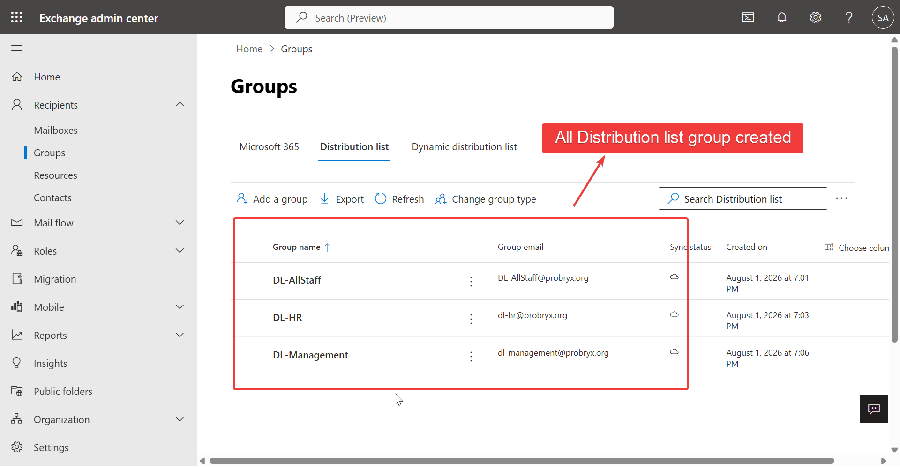
---

## Step 6 – Create Shared Mailboxes

Navigate to:

Exchange Admin Center

↓

Recipients

↓

Mailboxes

↓

Add Shared Mailbox

Create shared mailboxes for common business functions.

Examples:

- support@probryx.org
- info@probryx.org
- helpdesk@probryx.org

Assign the appropriate users with **Full Access** and **Send As** permissions.

### Technical Explanation

Shared mailboxes allow multiple users to manage a common mailbox without requiring separate user accounts or licenses (within Microsoft licensing limits). They improve collaboration while maintaining centralized communication.

### Screenshot

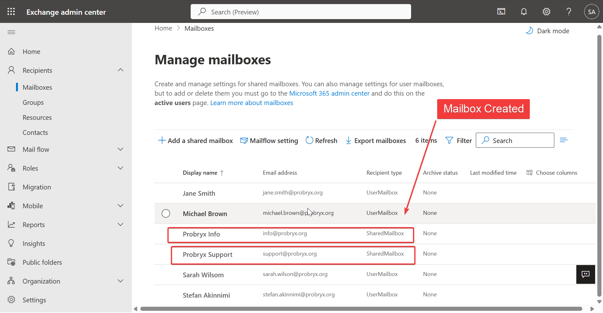

### Assign members to the shared mailbox

Assigned stefan.akinnimi the support@probryx.org shared mailbox

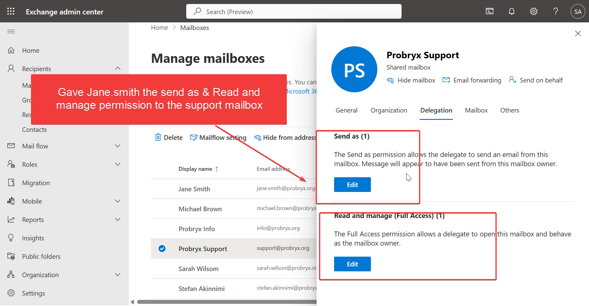


Assigned Jane.smith the permission to hr@probryx.org shared mailbox

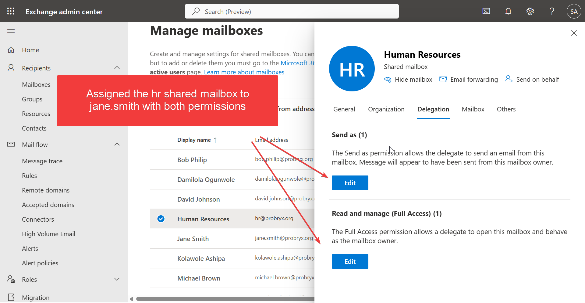


---

## Step 7 – Review Group Membership

Review the membership of all configured groups to ensure users have been assigned correctly.

Verify:

- Security Groups
- Microsoft 365 Groups
- Distribution Lists
- Shared Mailboxes

### Technical Explanation

Reviewing group membership helps ensure users receive the correct level of access and prevents unauthorized or excessive permissions.

### Screenshot

Removed M365-HR group owner access from Stefan & Micheal 

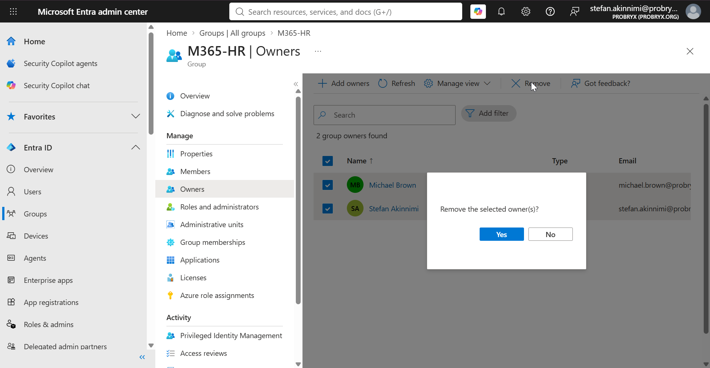

Added the HR manager as the owner of the M365-HR Group

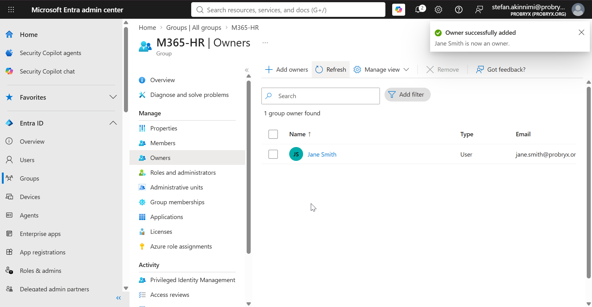

---

# Validation

The following tests were performed to verify that the configured groups function as expected.

| Validation Test | Expected Result | Status |
|-----------------|-----------------|:------:|
| Security Group Created | Group successfully created | ✅ |
| User Added to Security Group | Membership updated successfully | ✅ |
| Microsoft 365 Group Created | Collaboration group provisioned | ✅ |
| Distribution List Created | Email distribution list available | ✅ |
| Shared Mailbox Created | Mailbox accessible by assigned users | ✅ |
| Group Owner Assigned | Group ownership configured correctly | ✅ |

---

## Validation 1 – Security Group Membership

**Objective**

Verify that users were successfully added to the appropriate Security Groups.

**Result**

Users were successfully assigned to their departmental Security Groups.

### Screenshot

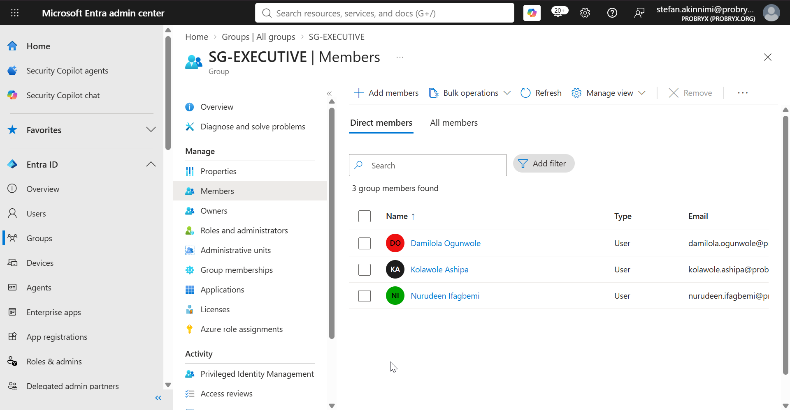

---

## Validation 2 – Microsoft 365 Group

**Objective**

Verify that the Microsoft 365 Group was created successfully.

**Result**

The group was provisioned with the associated Microsoft 365 resources, including Outlook, SharePoint, and Teams.

### Screenshot

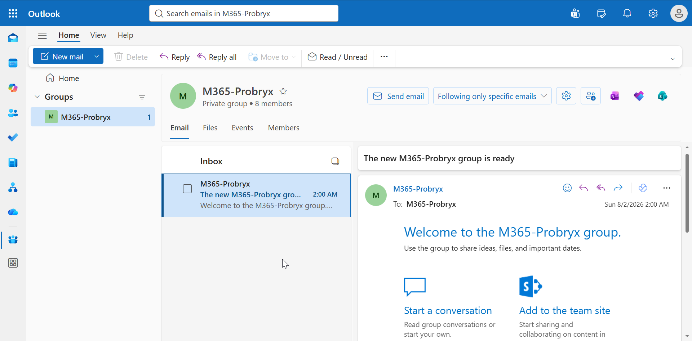

---

## Validation 3 – Distribution List

**Objective**

Verify that the Distribution List is available for email communication.

**Result**

The Distribution List was successfully created and is available for organizational email distribution.

### Screenshot

Sent a welcome from the HR manager account (Jane Smith) to all users using the dl-allstaff@probryx.org distribution mailbox

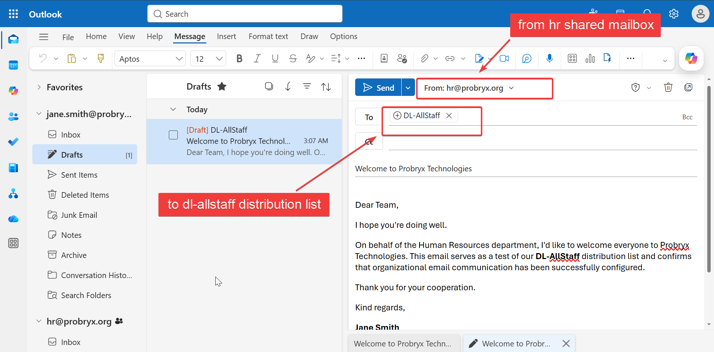

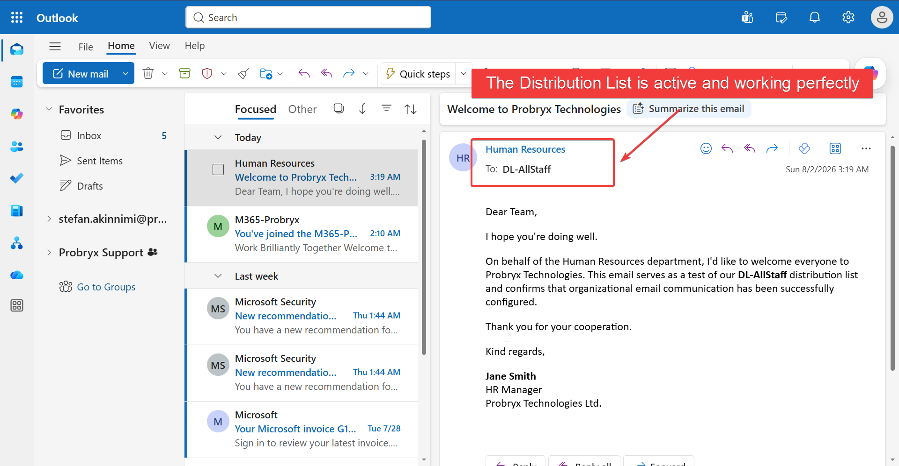

---

## Validation 4 – Shared Mailbox

**Objective**

Verify that authorized users can access the shared mailbox.

**Result**

Assigned users successfully accessed the shared mailbox and were able to send and receive email using delegated permissions.

### Screenshot

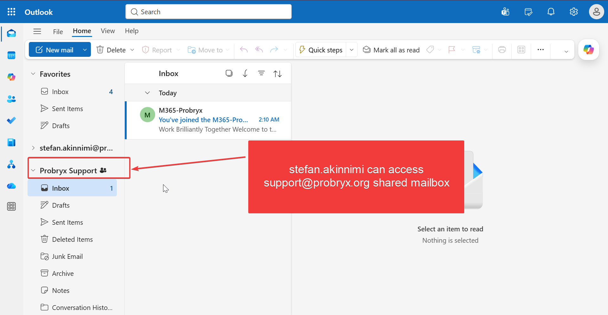

---

# Validation Summary

| Test | Result | Status |
|------|--------|:------:|
| Security Groups | Passed | ✅ |
| Microsoft 365 Groups | Passed | ✅ |
| Distribution Lists | Passed | ✅ |
| Shared Mailboxes | Passed | ✅ |

---

# Troubleshooting

| Issue | Possible Cause | Resolution |
|------|----------------|------------|
| Unable to create group | Insufficient permissions | Verify administrator role assignment |
| User not visible in group | Replication delay | Allow time for Microsoft 365 synchronization |
| Shared mailbox inaccessible | Missing permissions | Assign Full Access and Send As permissions |
| Distribution List not receiving mail | Membership configuration | Verify recipients and mail flow settings |
| Cant edit distribution mailbox details | Some groups can't be managed in the Azure portal | Used the M365 admin portal to edit a DL mailbox

---

# Lessons Learned

- Group-based administration simplifies permission management.
- Standardized naming conventions improve consistency and scalability.
- Microsoft 365 Groups provide integrated collaboration across Microsoft services.
- Shared mailboxes enable efficient management of departmental communication.
- Regular membership reviews help maintain secure and accurate access control.

---

# Conclusion

The identity group strategy was successfully implemented using Microsoft Entra ID and Exchange Online. Security Groups, Microsoft 365 Groups, Distribution Lists, and Shared Mailboxes were configured to support secure access management and collaboration across the organization.

The deployment demonstrates enterprise best practices by applying standardized naming conventions, centralized group administration, delegated ownership, and group-based access control. This implementation provides a scalable foundation for future Microsoft 365 workloads, including Exchange Online, Microsoft Teams, SharePoint Online, and Intune.

---

# References

- Microsoft Entra ID Documentation
- Microsoft 365 Admin Center
- Exchange Admin Center
- Microsoft Learn – Identity and Access Management

---

# Change Log
|Version|Date|Author|
|---|---|---|
|1.0|2026-08-02|Stefan Akinnimi|

---
## Next Phase

➡️ **Identity Architecture**