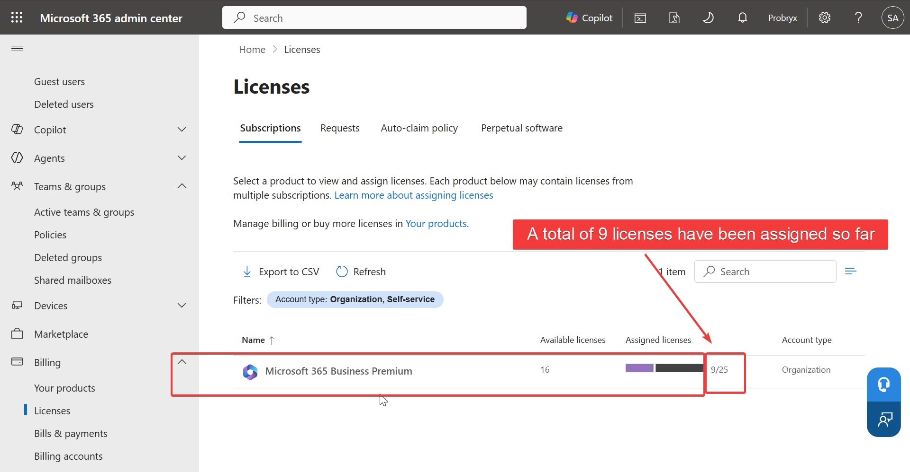
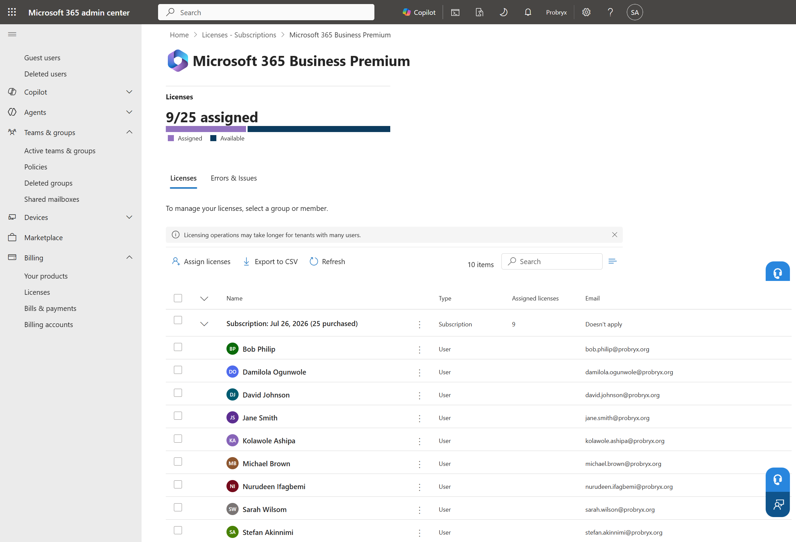
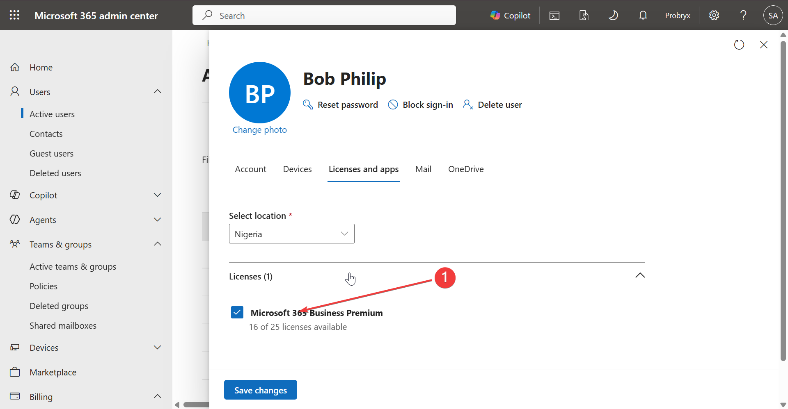
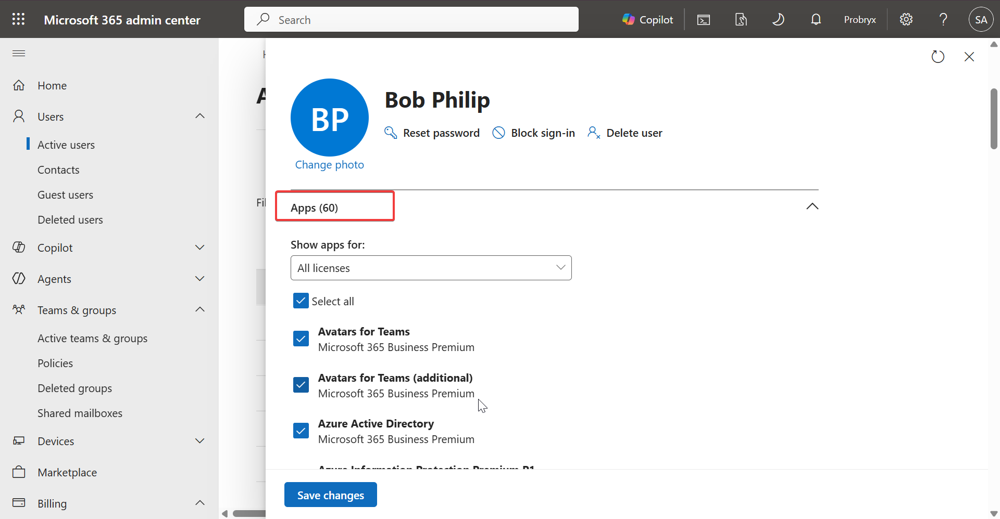
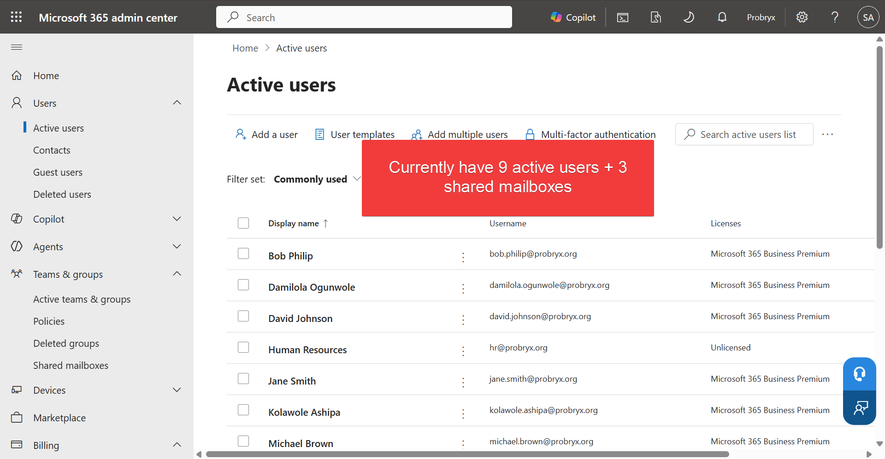

# Microsoft 365 Licensing

---

# Business Requirement

Microsoft 365 licensing enables users to access cloud services such as Exchange Online, Microsoft Teams, SharePoint Online, OneDrive, and Microsoft Entra ID Premium features. Proper license management ensures users receive the correct services while helping the organization optimize costs and maintain compliance.

---

# Implementation Overview

This phase configures Microsoft 365 Business Premium licenses for users within the Probryx Technologies Ltd. tenant. Licenses are assigned based on business roles and organizational requirements.

---

# Objectives

- Review available subscriptions
- Verify available licenses
- Assign Microsoft 365 Business Premium licenses
- Validate successful license assignment
- Review license consumption
- Document licensing strategy

---

# Prerequisites

Before beginning this phase, ensure the following have been completed:

- Microsoft 365 tenant configured
- Verified custom domain
- Microsoft Entra ID configured
- User accounts created
- Administrative account available
- Identity Management completed

---

# Licensing Strategy

The organization uses **Microsoft 365 Business Premium** as the primary productivity and security license for all employees.

### Benefits

- Exchange Online
- Microsoft Teams
- SharePoint Online
- OneDrive for Business
- Microsoft Defender for Business
- Microsoft Intune
- Microsoft Entra ID Premium P1

---

# License Assignment Matrix

| User | Department | License |
|------|------------|---------|
| Kolawole Ashipa | Executive | Microsoft 365 Business Premium |
| Stefan Akinnimi | IT | Microsoft 365 Business Premium |
| Damilola Ogunwole | Executive | Microsoft 365 Business Premium |
| Nurudeen Ifagbemi | Executive | Microsoft 365 Business Premium |
| Jane Smith | HR | Microsoft 365 Business Premium |
| Bob Philip | HR | Microsoft 365 Business Premium |
| David Johnson | Finance | Microsoft 365 Business Premium |
| Sarah Wilson | Sales | Microsoft 365 Business Premium |
| Michael Brown | Operations | Microsoft 365 Business Premium |

---

# Configuration Steps

---

## Step 1 – Review Available Licenses

Navigate to:

Microsoft 365 Admin Center

↓

Billing

↓

Licenses

Review the available Microsoft 365 subscriptions.

### Technical Explanation

Reviewing available licenses ensures the organization has sufficient capacity before assigning licenses to users.

### Screenshot

---

## Step 2 – Review License Details

Select the Microsoft 365 Business Premium subscription and review:

- Total licenses
- Assigned licenses
- Available licenses

### Technical Explanation

Reviewing subscription details confirms license availability and identifies the Microsoft services included in the subscription.

### Screenshot

---

## Step 3 – Assign License to Users

Navigate to:

Microsoft 365 Admin Center

↓

Users

↓

Active Users

↓

Licenses and Apps

Assign Microsoft 365 Business Premium licenses to each employee.

### Technical Explanation

License assignment activates Microsoft 365 services for users and determines which cloud workloads they can access.

### Screenshot

---

## Step 4 – Verify Assigned Services

Review the services enabled under the assigned license.

Examples include:

- Exchange Online
- Microsoft Teams
- SharePoint Online
- OneDrive
- Microsoft Intune
- Microsoft Defender
- Microsoft Entra ID Premium P1

### Technical Explanation

Verifying assigned services confirms that users have access to the workloads required for their roles.

### Screenshot

---

# Validation

| Validation Test | Expected Result | Status |
|-----------------|-----------------|:------:|
| Subscription Available | Microsoft 365 Business Premium visible | ✅ |
| License Assigned | User successfully licensed | ✅ |
| Services Enabled | Assigned services available | ✅ |
| License Usage Updated | Assigned license count increased | ✅ |

---

## Validation 1 – User License

**Objective**

Verify that a user has been successfully assigned a Microsoft 365 Business Premium license.

### Screenshot

Jane.smith is able to log into Microsoft and chat with her colleagues

---

## Validation 2 – Tenant License Usage

**Objective**

Confirm that tenant license consumption reflects the assigned licenses.

### Screenshot

---

# Troubleshooting

| Issue | Possible Cause | Resolution |
|------|----------------|------------|
| Unable to assign license | No licenses available | Purchase or free additional licenses |
| License assignment delayed | Synchronization delay | Wait a few minutes and refresh |
| Service unavailable | Service disabled | Enable required service under Licenses and Apps |
| License conflict | Multiple subscriptions | Review assigned products |

---

# Lessons Learned

- Licensing controls access to Microsoft 365 workloads.
- Assigning licenses based on business roles simplifies administration.
- Regular license reviews help optimize subscription costs.
- Verifying enabled services ensures users receive the correct functionality.

---

# Conclusion

Microsoft 365 Business Premium licenses were successfully assigned to users within the Probryx Technologies Ltd. tenant. License assignments enabled core Microsoft 365 services, including Exchange Online, Microsoft Teams, SharePoint Online, OneDrive, Microsoft Intune, and Microsoft Defender for Business. This implementation provides the licensing foundation required for the remaining phases of the Enterprise Microsoft 365 Deployment project.

---

# References

- Microsoft Learn – Microsoft 365 Licensing
- Microsoft 365 Admin Center
- Microsoft Learn – Assign Licenses to Users

---

## Navigation

⬅️ **Previous:** Identity Architecture (../04-identity/Identity-Management.md)

🏠 **Project Home:** [../README.md](../README.md)

➡️ **Next:** Exchange Online