# Exchange Online

---

# Business Requirement

Exchange Online provides enterprise-grade email, calendaring, contacts, and collaboration services for Probryx Technologies Ltd. This phase configures the organization's cloud-based messaging platform, verifies mail flow, and establishes a secure and reliable email environment for all users.

---

# Implementation Overview

This phase validates the Exchange Online deployment, configures organizational mail settings, creates shared mailboxes and distribution lists, tests internal and external mail flow, and verifies mailbox functionality.

---

# Objectives

- Verify Exchange Online deployment
- Review accepted domains
- Configure organization settings
- Validate user mailboxes
- Configure shared mailboxes
- Configure distribution lists
- Test internal mail flow
- Test external mail flow
- Verify Outlook Web Access (OWA)
- Validate Exchange functionality

---

# Prerequisites

Before beginning this phase, ensure:

- Microsoft 365 tenant configured
- Custom domain verified
- Microsoft 365 Business Premium licenses assigned
- User accounts created
- Exchange Online licenses assigned
- Identity Management completed

---

# Exchange Online Architecture

| Component | Purpose |
|------------|---------|
| Exchange Online | Cloud email platform |
| User Mailboxes | Individual email accounts |
| Shared Mailboxes | Shared departmental communication |
| Distribution Lists | Group email delivery |
| Outlook Web | Browser-based email |
| Exchange Admin Center | Exchange administration |

---

# Mailbox Inventory

| User | Mailbox |
|------|---------|
| Kolawole Ashipa | kolawole.ashipa@probryx.org |
| Stefan Akinnimi | stefan.akinnimi@probryx.org |
| Damilola Ogunwole | damilola.ogunwole@probryx.org |
| Nurudeen Ifagbemi | nurudeen.ifagbemi@probryx.org |
| Jane Smith | jane.smith@probryx.org |
| Bob Philip | bob.philip@probryx.org |
| David Johnson | david.johnson@probryx.org |
| Sarah Wilson | sarah.wilson@probryx.org |
| Michael Brown | michael.brown@probryx.org |

---

# Configuration Steps

---

## Step 1 – Verify Exchange Online

Navigate to

Microsoft 365 Admin Center

↓

Show All

↓

Exchange

Open the Exchange Admin Center and verify the deployment.

### Technical Explanation

Exchange Admin Center provides centralized administration for mailboxes, mail flow, recipients, and organizational messaging settings.

### Screenshot

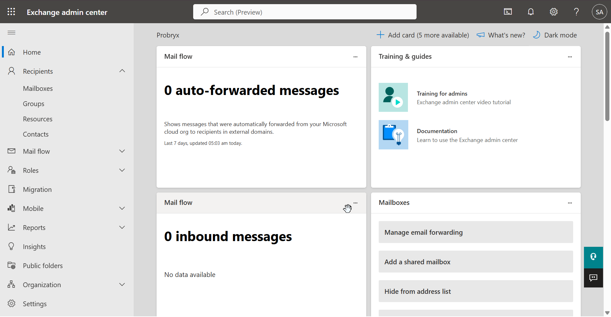

---

## Step 2 – Review Accepted Domains

Navigate to

Exchange Admin Center

↓

Mail Flow

↓

Accepted Domains

Verify:

- probryx.org
- Initial Microsoft domain

### Technical Explanation

Accepted domains define which email domains Exchange Online accepts mail for.

### Screenshot

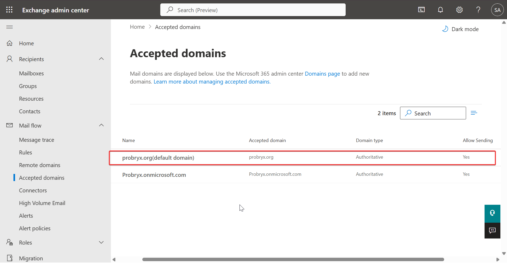

---

## Step 3 – Verify User Mailboxes

Navigate to

Recipients

↓

Mailboxes

Verify all licensed users have mailboxes.

### Technical Explanation

Exchange Online automatically provisions a mailbox after a licensed user is assigned an Exchange-enabled license.

### Screenshot

---

## Step 4 – Review Shared Mailboxes

Verify:

- support@probryx.org
- helpdesk@probryx.org
- info@probryx.org

### Technical Explanation

Shared mailboxes allow multiple users to access a common mailbox without sharing credentials.

### Screenshot

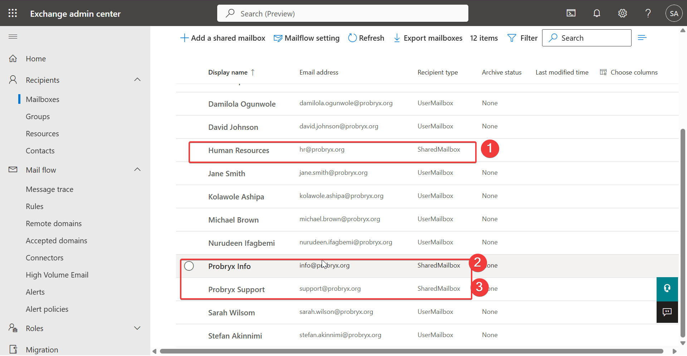

---

## Step 5 – Review Distribution Lists

Verify:

- DL-AllStaff
- DL-Management
- DL-HR
- DL-IT
- DL-Finance
- DL-Sales
- DL-Operations

### Technical Explanation

Distribution Lists enable one-to-many email communication using a single email address.

### Screenshot

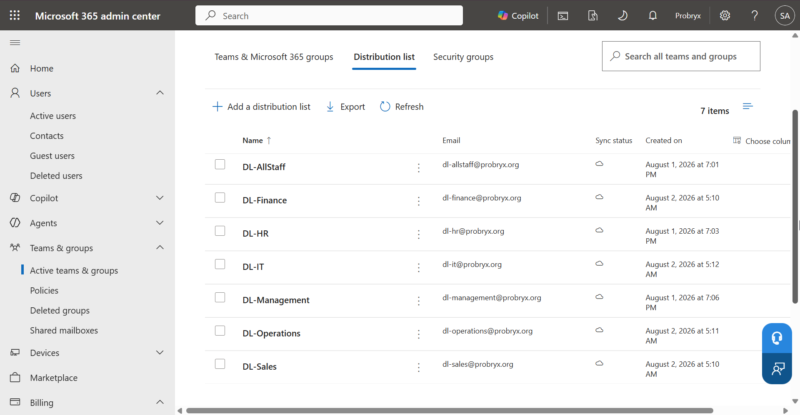

---

## Step 6 – Outlook Web Access

Sign in as:

Jane Smith

Verify:

- Mailbox access
- Inbox
- Sent Items
- Calendar
- Contacts

### Technical Explanation

Outlook on the Web provides browser-based access to Exchange Online mailboxes.

### Screenshot

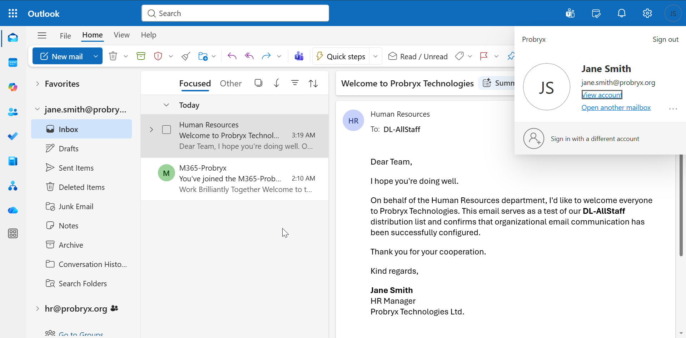

---

## Step 7 – Internal Mail Flow Test

Send an email:

From:

Jane Smith

To:

DL-AllStaff@probryx.org

Verify delivery to all users.

### Technical Explanation

Internal mail flow validates message delivery between mailboxes within the Microsoft 365 tenant.

### Screenshot

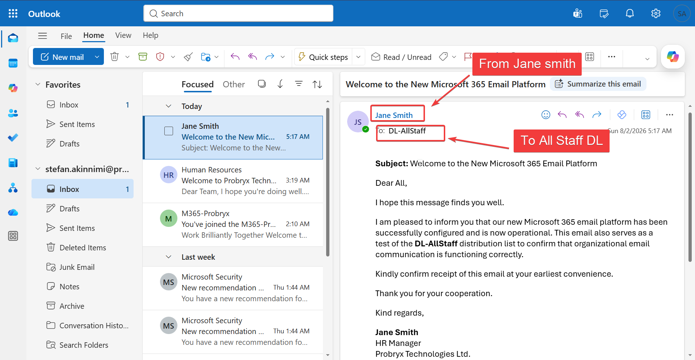

---

## Step 8 – External Mail Flow Test

Send an email from:

Gmail (or another external provider)

↓

probryx.org mailbox

Reply from Exchange Online.

### Technical Explanation

External mail flow confirms successful communication between Exchange Online and external email systems.

### Screenshot

Inbound mail from external Gmail account

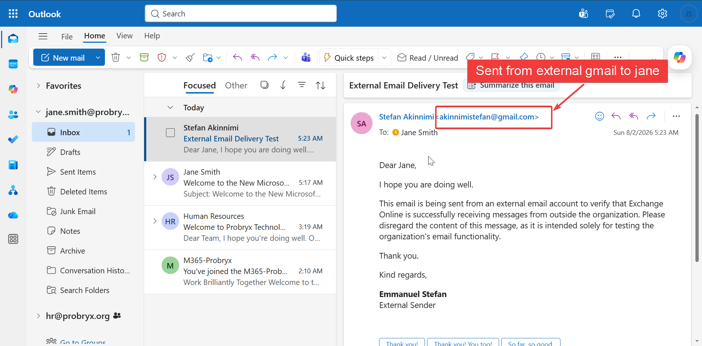

Outbound mail to external Gmail account

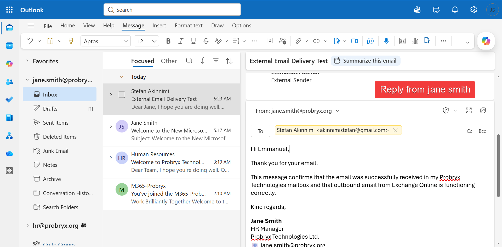

Emmanuel Recieves the mail in his Gmail inbox 
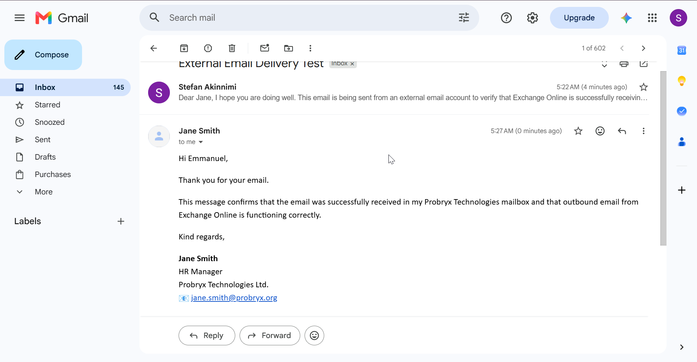

Inbound & Outbound confirmed ✅✅

---

## Step 9 – Review Mail Flow Settings

Navigate to

Exchange Admin Center

↓

Mail Flow

Review:

- Rules
- Connectors
- Remote Domains

No changes are required during this phase.

### Technical Explanation

Mail flow settings control how messages are processed and routed within Exchange Online.

### Screenshot

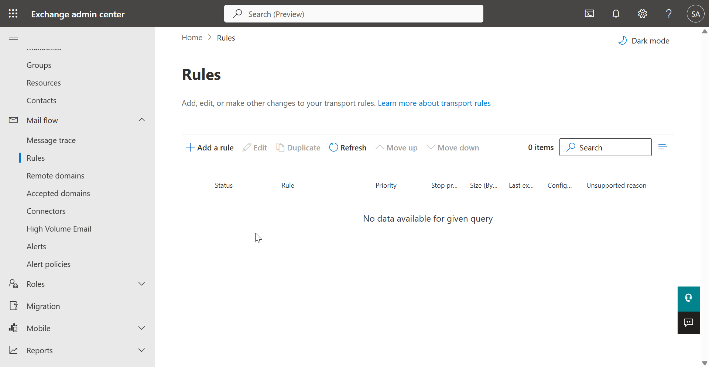

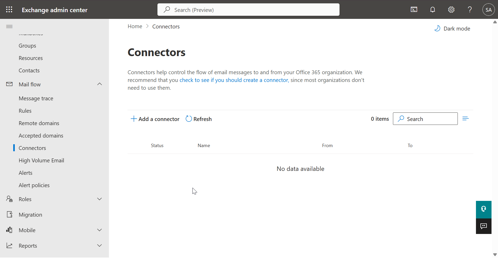

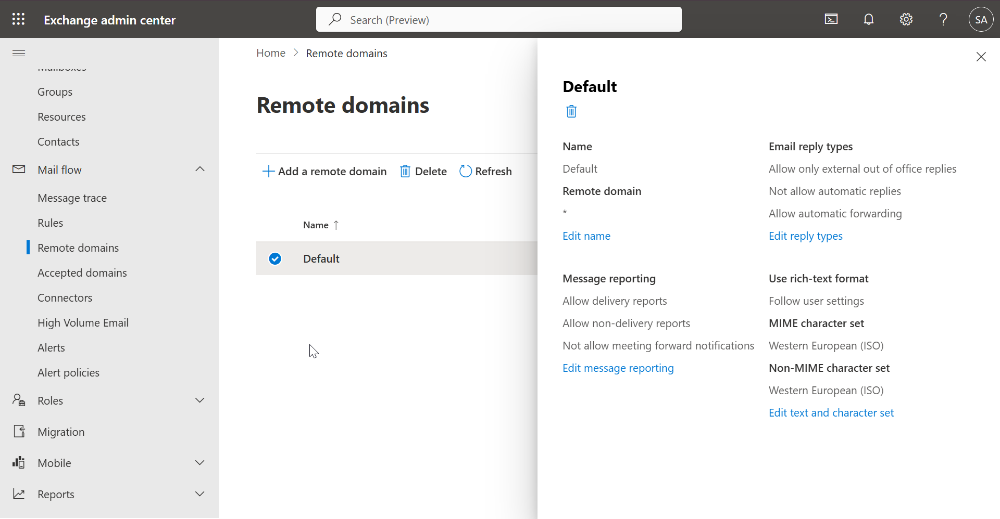

---

# Validation

| Validation | Expected Result | Status |
|------------|-----------------|:------:|
| Exchange Admin Center Accessible | Success | ✅ |
| User Mailboxes Created | Success | ✅ |
| Shared Mailboxes Available | Success | ✅ |
| Distribution Lists Available | Success | ✅ |
| Internal Mail Flow | Success | ✅ |
| External Mail Flow | Success | ✅ |
| Outlook Web Access | Success | ✅ |

---

# Troubleshooting

| Issue | Resolution |
|--------|------------|
| Mailbox not provisioned | Verify license assignment and allow time for provisioning |
| Email not delivered | Check recipient address and mail flow |
| Shared mailbox inaccessible | Verify delegated permissions |
| Distribution list not receiving mail | Confirm group membership and delivery settings |

---

# Lessons Learned

- Exchange Online provisioning depends on correct license assignment.
- Shared mailboxes simplify departmental communication.
- Distribution Lists improve organization-wide messaging.
- Internal and external mail flow validation confirms a healthy messaging environment.
- Exchange Online provides a secure, scalable cloud messaging platform integrated with Microsoft 365.

---

# Conclusion

Exchange Online was successfully deployed and validated for Probryx Technologies Ltd. User mailboxes, shared mailboxes, and distribution lists were verified, and both internal and external mail flow operated as expected. This phase establishes a reliable enterprise messaging platform that supports secure communication and collaboration across the organization.

---

# References

- Microsoft Learn – Exchange Online
- Exchange Admin Center
- Microsoft 365 Admin Center

---

## Navigation

⬅️ Previous: [Licensing](05-Licensing.md)

🏠 Project Home: [../README.md](../README.md)

➡️ Next: [Microsoft Teams](07-Microsoft-Teams.md)