# Microsoft Teams

---

# Business Requirement

Microsoft Teams provides a centralized collaboration platform for messaging, meetings, file sharing, and teamwork. This phase deploys Microsoft Teams for Probryx Technologies Ltd., enabling secure communication and collaboration across departments while integrating with Microsoft 365 services.

---

# Implementation Overview

This phase validates the Microsoft Teams deployment, reviews organizational settings, creates departmental teams, configures channels, assigns members, and verifies collaboration features.

---

# Objectives

- Verify Microsoft Teams deployment
- Review Teams Admin Center
- Create departmental Teams
- Configure channels
- Add team members
- Test chat functionality
- Test meetings
- Validate file sharing
- Verify Teams functionality

---

# Prerequisites

Before beginning this phase, ensure:

- Microsoft 365 tenant configured
- Microsoft 365 Business Premium licenses assigned
- Exchange Online configured
- Users created
- Groups created
- Microsoft Teams licenses available

---

# Teams Architecture

| Component | Purpose |
|------------|---------|
| Microsoft Teams | Collaboration Platform |
| Teams | Department Collaboration |
| Channels | Department Conversations |
| Chat | Instant Messaging |
| Meetings | Audio & Video Conferencing |
| Files | SharePoint Document Storage |

---

# Team Structure

| Team | Members |
|-------|---------|
| Executive | Kolawole Ashipa, Damilola Ogunwole, Nurudeen Ifagbemi |
| IT | Stefan Akinnimi |
| Human Resources | Jane Smith, Bob Philip |
| Finance | David Johnson |
| Sales | Sarah Wilson |
| Operations | Michael Brown |

---

# Configuration Steps

---

## Step 1 – Verify Microsoft Teams

Navigate to

Microsoft Teams Admin Center

Verify that the Teams Admin Center is accessible.

### Technical Explanation

The Teams Admin Center provides centralized administration for Teams, meetings, messaging policies, voice, and devices.

### Screenshot

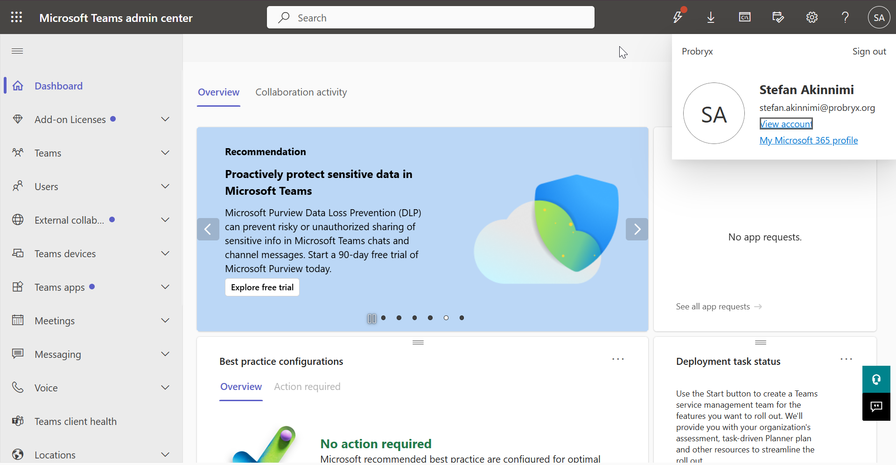

---

## Step 2 – Review Organization Settings

Navigate to

Teams Admin Center

↓

Org-wide Settings

Review:

- External Access
- Guest Access
- Teams Settings

No changes are required during this phase.

### Technical Explanation

Organization settings define how users collaborate with internal and external users.

### Screenshot

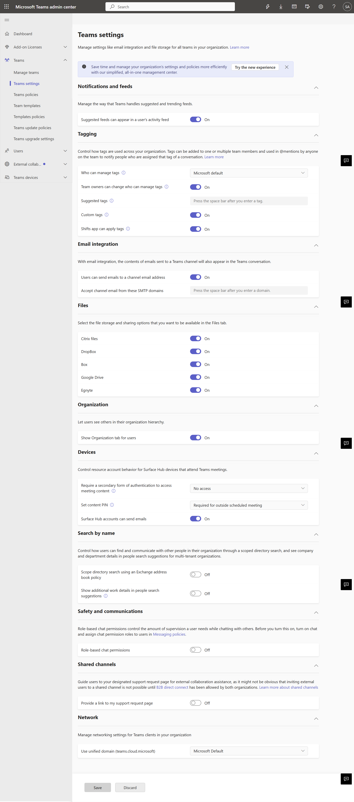

---

## Step 3 – Create Department Teams

Create the following Teams:

- Executive
- IT
- Human Resources
- Finance
- Sales
- Operations

### Technical Explanation

Teams provide dedicated collaboration workspaces for departments.

### Screenshot

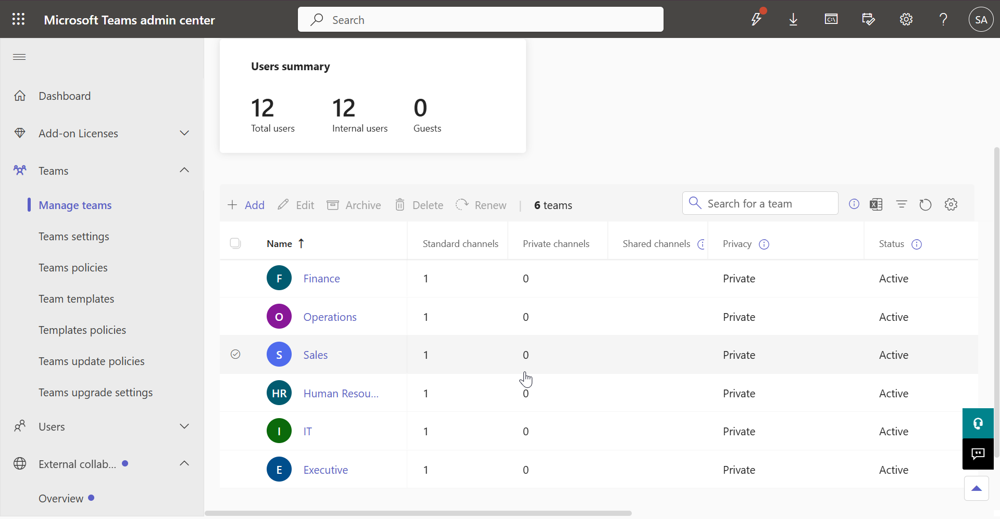

---

## Step 4 – Create Standard Channels

Create the following channels where applicable:

- General
- Announcements

### Technical Explanation

Channels organize conversations and files into logical workspaces.

### Screenshot

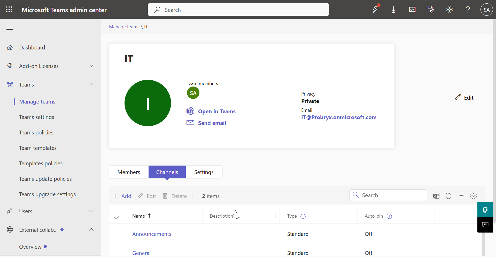

---

## Step 5 – Add Members

Assign users to their respective Teams.

Example:

Executive Team

- Kolawole Ashipa
- Damilola Ogunwole
- Nurudeen Ifagbemi

### Screenshot

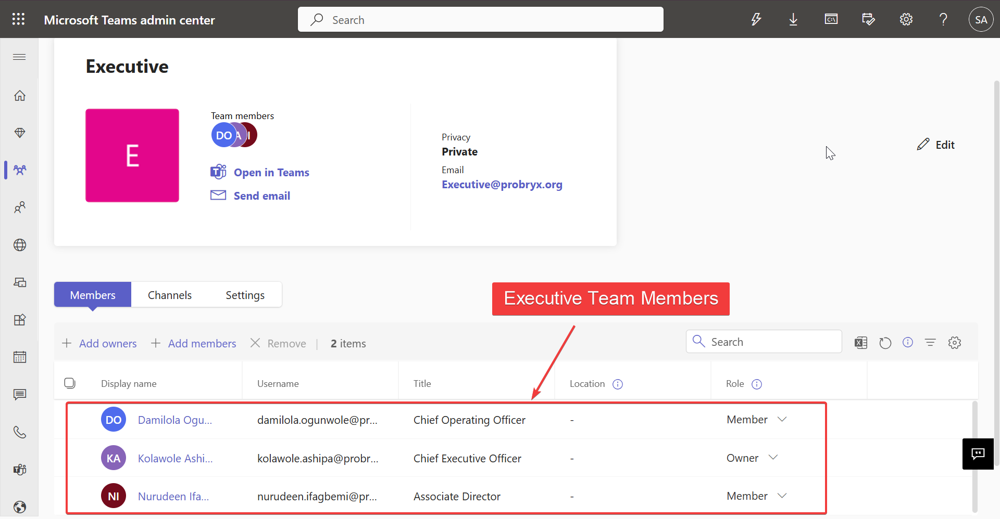

HR Team

- Jane Smith
- Bob Philip

### Screenshot

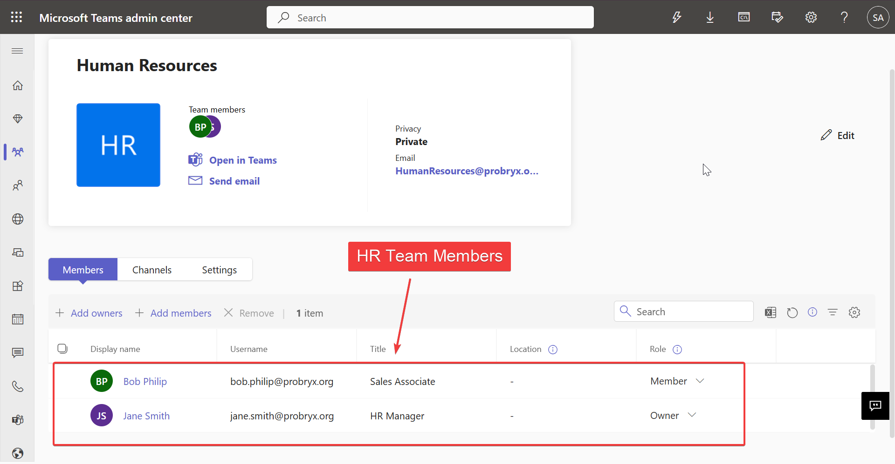

IT Team

- Stefan Akinnimi

### Screenshot

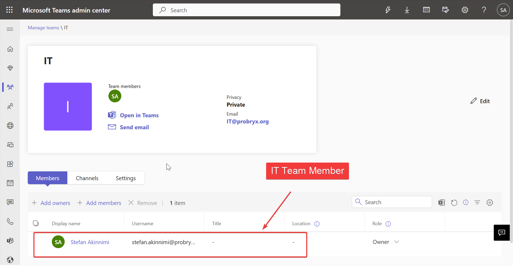

### Technical Explanation

Team membership determines access to conversations, meetings, and shared files.

---

## Step 6 – Test Team Chat

Sign in as Jane Smith.

Send a message to the HR Team.

Example:

> Welcome to the Human Resources Team. This message confirms that Microsoft Teams chat has been successfully configured.

### Technical Explanation

Team chat provides persistent communication between members.

### Screenshot

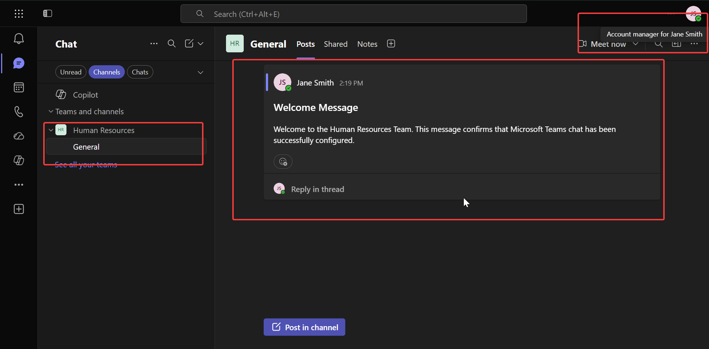

---

## Step 7 – Schedule a Meeting

Create a Teams meeting.

Verify:

- Meeting invitation
- Calendar integration
- Join link

### Technical Explanation

Teams meetings integrate with Exchange Online calendars to provide enterprise scheduling.

### Screenshot

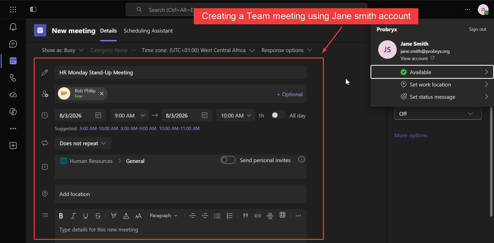

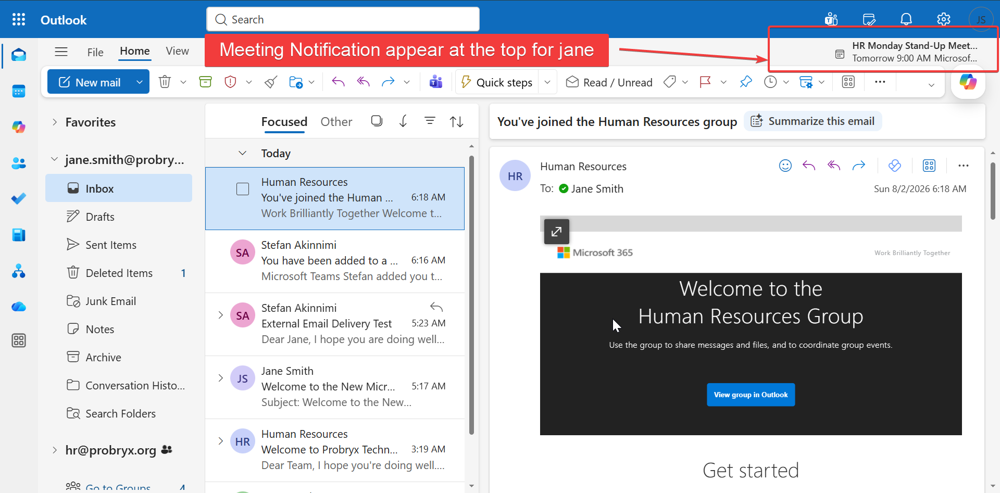
---

## Step 8 – Share a File

Upload a document into the HR Team.

Verify:

- File upload
- File synchronization
- SharePoint integration

### Technical Explanation

Files shared within Teams are stored securely in SharePoint Online.

### Screenshot

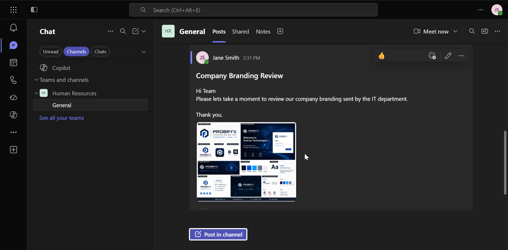

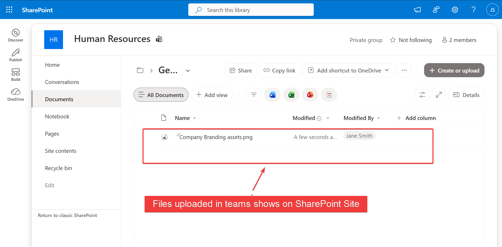

---

## Step 9 – Verify Teams Policies

Navigate to

Teams Admin Center

↓

Teams Policies

Review the default policy configuration.

No changes are required during this phase.

### Technical Explanation

Teams policies define user permissions and collaboration settings.

### Screenshot

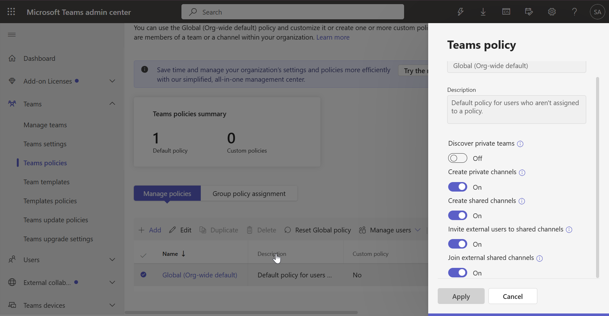

---

# Validation

| Validation | Expected Result | Status |
|------------|-----------------|:------:|
| Teams Admin Center Accessible | Success | ✅ |
| Teams Created | Success | ✅ |
| Channels Created | Success | ✅ |
| Members Added | Success | ✅ |
| Chat Working | Success | ✅ |
| Meeting Created | Success | ✅ |
| File Sharing Working | Success | ✅ |

---

# Troubleshooting

| Issue | Resolution |
|--------|------------|
| Team not visible | Allow provisioning time and refresh the Teams client |
| User cannot access Team | Verify membership assignment |
| Meeting unavailable | Confirm Exchange Online mailbox and Teams license |
| File upload failed | Verify SharePoint Online is available |

---

# Lessons Learned

- Microsoft Teams integrates closely with Exchange Online and SharePoint Online.
- Department-based Teams improve collaboration and information sharing.
- Channels help organize conversations and project work.
- Team membership should align with organizational structure.
- Files shared in Teams are securely stored in SharePoint Online.

---

# Conclusion

Microsoft Teams was successfully deployed and validated for Probryx Technologies Ltd. Departmental Teams, channels, meetings, chat, and file sharing were configured and tested. The deployment provides a secure collaboration platform that integrates seamlessly with Microsoft 365 services and supports communication across the organization.

---

# References

- Microsoft Learn – Microsoft Teams
- Microsoft Teams Admin Center
- Microsoft Learn – Teams Administration

---

## Navigation

⬅️ Previous: Licensing

🏠 Project Home: [../README.md](../README.md)

➡️ Next: SharePoint Online