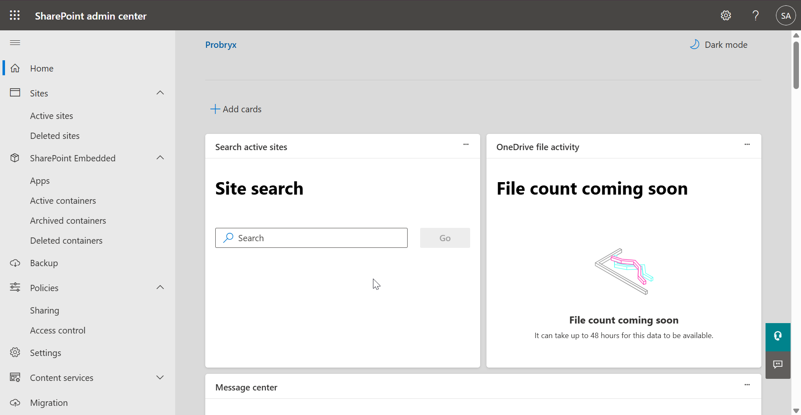
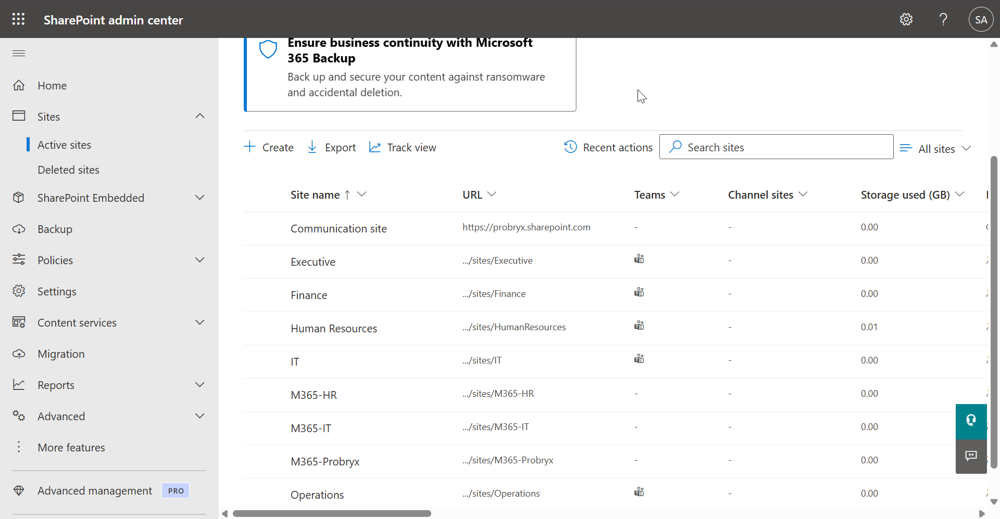
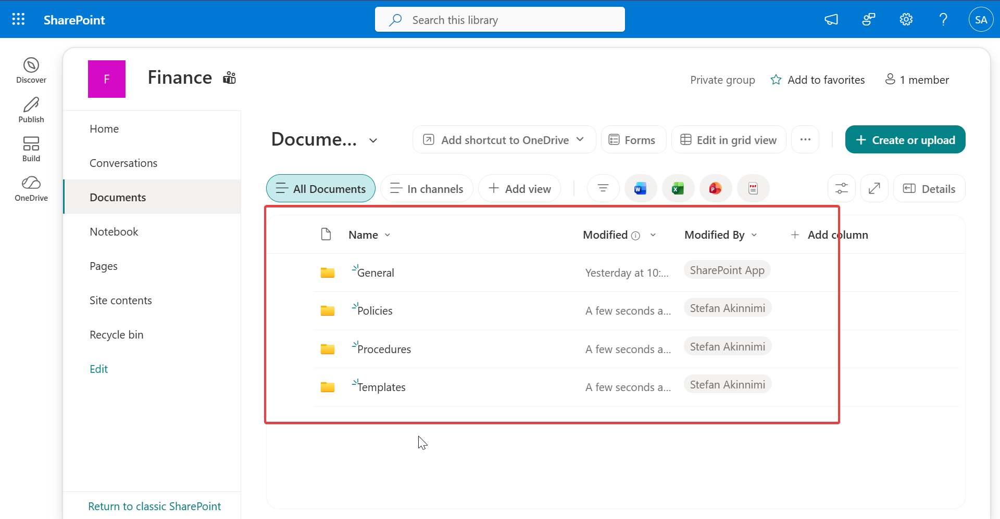

# SharePoint Online

---

# Business Requirement

SharePoint Online provides a secure, cloud-based platform for document management, collaboration, and intranet services. This phase configures SharePoint Online for Probryx Technologies Ltd., enabling departments to securely store, organize, and collaborate on business documents while maintaining centralized access control.

---

# Implementation Overview

This phase validates the SharePoint Online deployment, reviews the SharePoint Admin Center, creates departmental sites, configures document libraries, manages permissions, enables versioning, and validates collaboration capabilities.

---

# Objectives

- Verify SharePoint Online deployment
- Review SharePoint Admin Center
- Create departmental SharePoint sites
- Configure document libraries
- Configure permissions
- Enable version history
- Validate document collaboration
- Test file sharing
- Verify SharePoint functionality

---

# Prerequisites

Before beginning this phase, ensure:

- Microsoft 365 tenant configured
- Identity Management completed
- Licensing completed
- Exchange Online configured
- Microsoft Teams configured
- Users and groups created

---

# SharePoint Architecture

| Component | Purpose |
|-----------|---------|
| SharePoint Admin Center | SharePoint administration |
| Communication Sites | Organization-wide communication |
| Team Sites | Department collaboration |
| Document Libraries | File storage |
| Lists | Structured information |
| Pages | Internal web content |

---

# Site Structure

| Site | Purpose | Members |
|------|---------|---------|
| Executive | Executive collaboration | Executive Team |
| IT | IT documentation | IT Team |
| Human Resources | HR documents | HR Team |
| Finance | Financial documents | Finance Team |
| Sales | Sales resources | Sales Team |
| Operations | Operations documents | Operations Team |

---

# Configuration Steps

---

## Step 1 – Verify SharePoint Online

Navigate to

Microsoft 365 Admin Center

↓

Admin Centers

↓

SharePoint

Verify that the SharePoint Admin Center is accessible.

### Technical Explanation

The SharePoint Admin Center provides centralized management for SharePoint sites, storage, permissions, and sharing policies.

### Screenshot

---

## Step 2 – Review Active Sites

Navigate to

SharePoint Admin Center

↓

Active Sites

Review the existing SharePoint sites.

### Technical Explanation

Active Sites displays all SharePoint sites within the tenant and their configuration.

### Screenshot

---

## Step 3 – Create Document Libraries

Within each Team Site, create document libraries such as:

- Policies
- Procedures
- Projects
- Templates/

### Technical Explanation

Document Libraries organize business documents and support metadata, version history, and collaboration.

### Screenshot

---

## Step 4 – Configure Site Permissions

Assign permissions based on departmental membership.

Example:

- HR Team → Human Resources Site
- Finance Team → Finance Site
- IT Team → IT Site

### Technical Explanation

Permissions ensure that users only have access to the resources required for their job responsibilities.

### Screenshot

---

## Step 6 – Configure Version History

Enable Version History for document libraries.

Verify:

- Major Versions
- Version Limit
- Restore Previous Versions

### Technical Explanation

Version History protects documents by allowing previous versions to be restored when necessary.

### Screenshot

---

## Step 7 – Upload Documents

Upload sample documents to each department site.

Examples:

- HR Policy
- Employee Handbook
- IT Standard Operating Procedure
- Finance Budget Template
- Sales Proposal
- Operations Checklist

### Technical Explanation

Uploading documents validates storage functionality and collaboration features.

### Screenshot

---

## Step 8 – Test Collaboration

Open a document from the HR site as Jane Smith.

Verify:

- Edit document
- Save changes
- Version updated

### Technical Explanation

SharePoint supports real-time document collaboration and automatic version control.

### Screenshot

---

## Step 9 – Test File Sharing

Share a document with Bob Philip.

Verify:

- Internal sharing
- Permission inheritance
- Access confirmation

### Technical Explanation

SharePoint securely shares documents while maintaining centralized permission management.

### Screenshot

---

## Step 10 – Review SharePoint Settings

Navigate to

SharePoint Admin Center

↓

Settings

Review:

- External Sharing
- Storage Limits
- Access Control

No configuration changes are required during this phase.

### Technical Explanation

Reviewing SharePoint settings confirms that tenant-wide collaboration policies align with organizational requirements.

### Screenshot

---

# Validation

| Validation | Expected Result | Status |
|------------|-----------------|:------:|
| SharePoint Admin Center Accessible | Success | ✅ |
| Department Sites Created | Success | ✅ |
| Document Libraries Created | Success | ✅ |
| Permissions Assigned | Success | ✅ |
| Version History Enabled | Success | ✅ |
| File Upload Successful | Success | ✅ |
| Internal Sharing Successful | Success | ✅ |
| Document Collaboration Successful | Success | ✅ |

---

## Validation 1 – Department Sites

Verify departmental SharePoint sites have been successfully created.

### Screenshot

---

## Validation 2 – Document Libraries

Verify document libraries exist within each department site.

### Screenshot

---

## Validation 3 – File Collaboration

Verify users can edit documents collaboratively.

### Screenshot

---

## Validation 4 – File Sharing

Verify internal users can access shared documents.

### Screenshot

---

# Troubleshooting

| Issue | Resolution |
|--------|------------|
| Site not created | Wait for provisioning to complete and refresh the site list |
| Permission denied | Verify user or group membership and site permissions |
| Version history unavailable | Enable versioning in the document library settings |
| File not syncing | Confirm OneDrive sync client is signed in and running |

---

# Lessons Learned

- SharePoint Online provides centralized document management for the organization.
- Departmental Team Sites improve collaboration while maintaining secure access.
- Document Libraries simplify content organization and retrieval.
- Version History protects against accidental changes or deletions.
- SharePoint integrates seamlessly with Microsoft Teams and OneDrive.

---

# Conclusion

SharePoint Online was successfully deployed and validated for Probryx Technologies Ltd. Departmental Team Sites, document libraries, permissions, version history, and collaboration features were configured and tested. The implementation provides a secure, scalable document management platform that supports collaboration across the organization and serves as the foundation for Microsoft Teams file storage and OneDrive synchronization.

---

# References

- Microsoft Learn – SharePoint Online
- SharePoint Admin Center
- Microsoft Learn – SharePoint Administration

---

## Navigation

⬅️ Previous: Microsoft Teams

🏠 Project Home: [../README.md](../README.md)

➡️ Next: OneDrive for Business