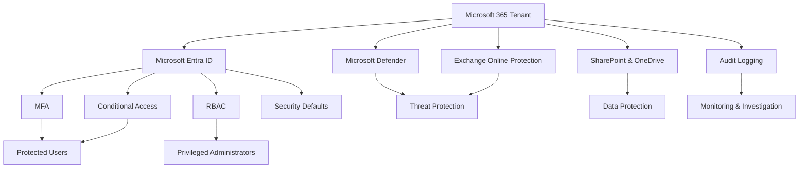
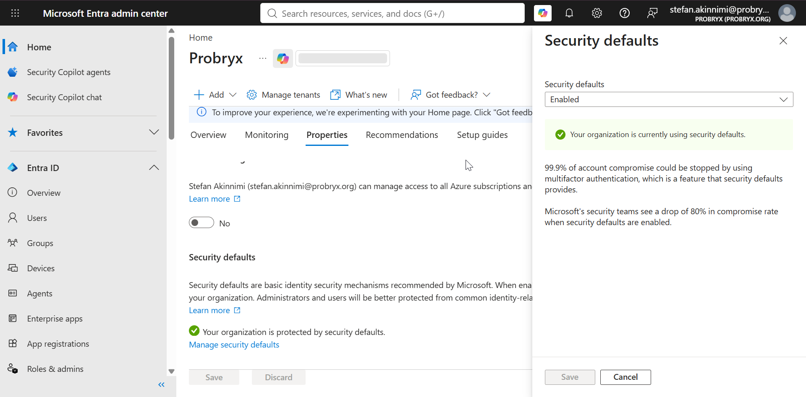
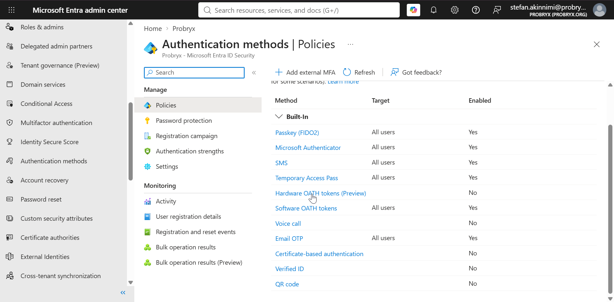
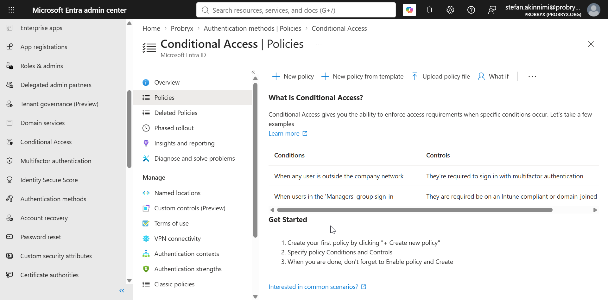
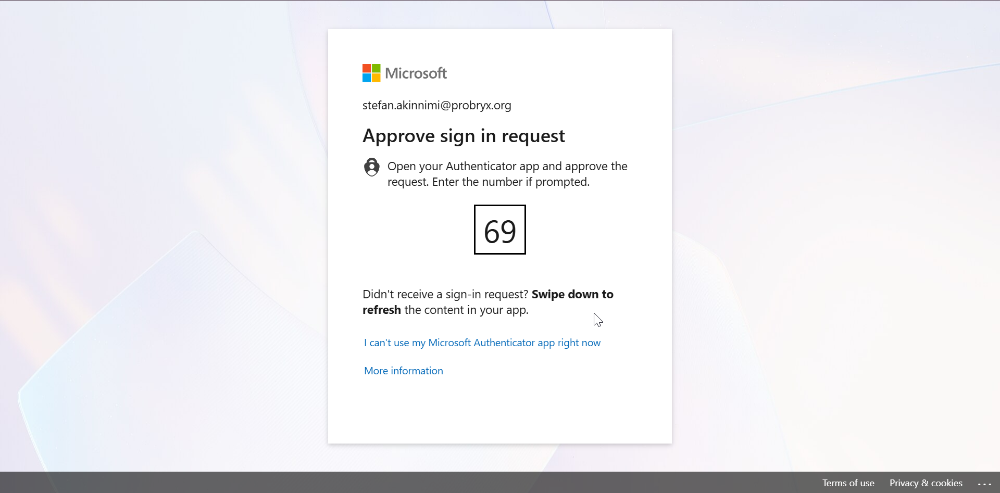
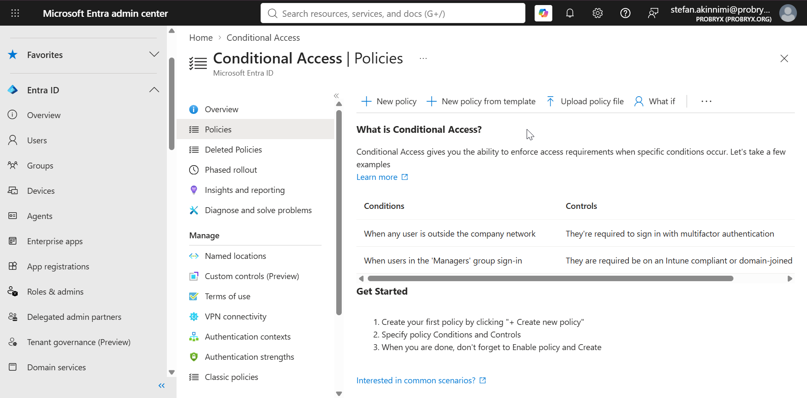
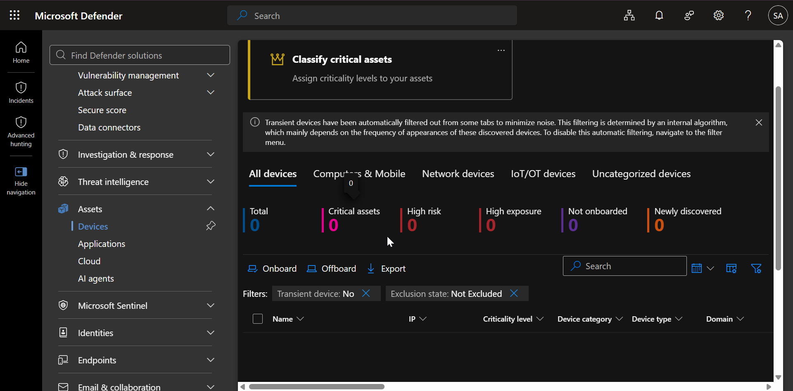
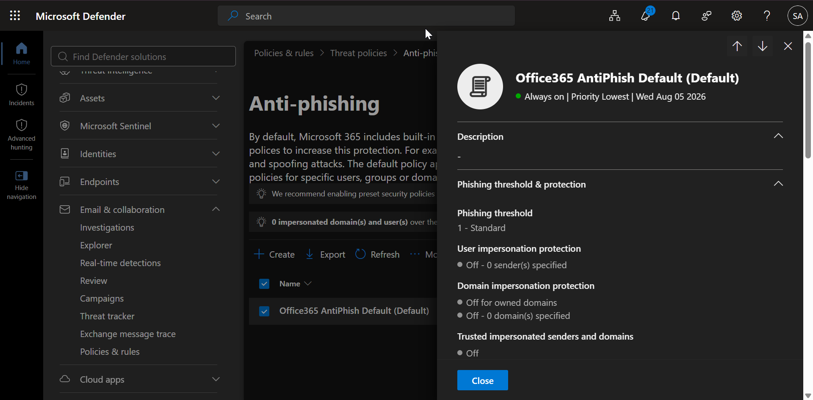

# Microsoft 365 Security Baseline

---

# Business Requirement

A security baseline establishes foundational security controls that protect user identities, devices, applications, and Microsoft 365 resources from common security threats.

This phase establishes the initial security posture for the Probryx Technologies Ltd. Microsoft 365 environment. Advanced Zero Trust controls will be implemented separately as part of Project 3.

---

# Implementation Overview

The security baseline focuses on foundational Microsoft 365 security controls, including:

- Microsoft Entra security defaults
- Multi-Factor Authentication (MFA)
- Conditional Access
- Legacy Authentication protection
- Administrator account protection
- Microsoft Defender for Business
- Exchange Online protection
- SharePoint and OneDrive sharing controls
- Microsoft 365 audit logging

---

# Objectives

- Establish a secure Microsoft 365 baseline
- Protect privileged accounts
- Enable MFA
- Review Conditional Access
- Block legacy authentication
- Review Microsoft Defender configuration
- Review Microsoft 365 audit logging
- Review external sharing controls
- Validate baseline security controls

---

# Prerequisites

Before beginning this phase, ensure:

- Microsoft 365 tenant configured
- Custom domain configured
- Identity Management completed
- Microsoft 365 Business Premium licenses assigned
- Exchange Online configured
- Microsoft Teams configured
- SharePoint Online configured
- Administrative accounts created

---

# Security Baseline Architecture

---

# Security Controls

| Control | Purpose | Status |
|---------|---------|:------:|
| MFA | Protect user identities | ✅ |
| Conditional Access | Control access based on conditions | ✅ |
| Legacy Authentication Protection | Prevent insecure authentication | ✅ |
| RBAC | Apply least privilege | ✅ |
| Microsoft Defender | Endpoint and threat protection | ⏳ |
| Audit Logging | Monitor administrative activity | ✅ |
| External Sharing Controls | Protect organisational data | ✅ |

---

# Configuration Steps

---

## Step 1 – Review Security Defaults

Navigate to:

**Microsoft Entra Admin Center**

→ **Overview**

→ **Properties**

→ **Manage Security Defaults**

Record the current configuration.

### Technical Explanation

Security Defaults provide basic identity protection, including MFA requirements and protection against legacy authentication.

Advanced Conditional Access policies will be implemented during the Zero Trust Security project.

### Screenshot

---

## Step 2 – Review Authentication Methods

Navigate to:

**Microsoft Entra Admin Center**

→ **Authentication methods**

Review the authentication methods available to users.

Verify:

- Microsoft Authenticator
- Temporary Access Pass
- Password
- Other enabled methods

### Technical Explanation

Authentication methods determine how users prove their identity when accessing Microsoft 365 resources.

### Screenshot

---

## Step 3 – Review Conditional Access

Navigate to:

**Microsoft Entra Admin Center**

→ **Entra ID**

→ **Conditional Access**

Review existing policies.

Document:

- Policy name
- Users/groups
- Target resources
- Conditions
- Grant controls
- Session controls
- Policy state

### Technical Explanation

Conditional Access evaluates signals such as user, device, location, and application before granting access.

### Screenshot
Conditional Access: No policies configured at this stage. Access protection is currently provided through Microsoft Entra Security Defaults. Advanced Conditional Access policies will be implemented during Project 3 – Zero Trust Security Implementation.

---

## Step 4 – Configure MFA for Administrators

Ensure privileged administrator accounts use Multi-Factor Authentication.

The following administrator accounts were reviewed:

- Kolawole Ashipa – Global Administrator
- Stefan Akinnimi – Global Administrator
- Jane Smith – User Administrator

### Technical Explanation

MFA adds an additional authentication factor and significantly reduces the risk of account compromise.

### Screenshot

Administrator MFA is enforced through Security Defaults. This provides an additional authentication factor for privileged accounts without requiring a separate MFA policy.
---

## Step 5 – Review Legacy Authentication Protection

Review Conditional Access policies and authentication settings to ensure legacy authentication is not permitted.

### Technical Explanation

Legacy authentication does not support modern authentication controls such as MFA and should be restricted.

### Screenshot

Legacy authentication is blocked through Security Defaults. This prevents older authentication methods that do not support modern security controls such as MFA.

---

## Step 6 – Review Microsoft Defender for Business

Navigate to:

**Microsoft Defender Portal**

Review:

- Device inventory
- Antivirus
- Endpoint security
- Threat detection
- Security recommendations

### Technical Explanation

Microsoft Defender for Business provides endpoint protection and threat detection for supported devices.

### Screenshot

---

## Step 7 – Review Exchange Online Protection

Review Exchange Online security configuration.

Verify:

- Anti-spam
- Anti-malware
- Quarantine
- Safe Attachments
- Safe Links

### Technical Explanation

Exchange Online Protection helps protect organisational email from spam, malware, phishing, and malicious links.

### Screenshot

---

## Step 8 – Review SharePoint and OneDrive Sharing

Navigate to:

**SharePoint Admin Center**

→ **Policies**

→ **Sharing**

Review:

- SharePoint external sharing
- OneDrive external sharing
- Default sharing links
- Guest access

### Technical Explanation

Sharing policies control how organisational data can be shared internally and externally.

### Screenshot

---

## Step 9 – Verify Audit Logging

Navigate to:

**Microsoft Purview Portal**

→ **Solutions**

→ **Audit**

Verify that audit logging is available.

### Technical Explanation

Audit logging records user and administrator activities across Microsoft 365 and supports security investigations.

### Screenshot

---

# Security Baseline Validation

| Validation | Expected Result | Status |
|------------|-----------------|:------:|
| Security Defaults Reviewed | Configuration documented | ✅ |
| MFA | Administrators protected | ✅ |
| Conditional Access | Policies reviewed | ✅ |
| Legacy Authentication | Restricted | ✅ |
| Defender | Configuration reviewed | ⏳ |
| Exchange Protection | Protection enabled | ✅ |
| External Sharing | Configuration reviewed | ✅ |
| Audit Logging | Logging available | ✅ |

---

## Validation 1 – Administrator MFA

Sign in using an administrator account and verify that MFA is required.

### Screenshot

---

## Validation 2 – Conditional Access

Verify that Conditional Access policies are enabled and applying correctly.

### Screenshot

---

## Validation 3 – Legacy Authentication

Verify that legacy authentication is blocked or restricted.

### Screenshot

---

## Validation 4 – Audit Logs

Generate or review a Microsoft 365 activity and verify that the activity appears in the audit logs.

### Screenshot

---

# Security Baseline Status

| Security Area | Status |
|---------------|:------:|
| Identity Protection | ✅ |
| MFA | ✅ |
| Conditional Access | ✅ |
| Legacy Authentication Protection | ✅ |
| Exchange Protection | ✅ |
| SharePoint Protection | ✅ |
| Audit Logging | ✅ |
| Endpoint Protection | ⏳ |

---

# Troubleshooting

| Issue | Possible Cause | Resolution |
|------|----------------|------------|
| MFA not triggered | Policy not applied | Review Conditional Access scope |
| Conditional Access not working | Policy disabled | Verify policy state |
| User cannot access service | Policy restriction | Review sign-in logs |
| Audit activity unavailable | Logging delay | Allow time for events to appear |
| Defender device unavailable | Device not onboarded | Review Intune and Defender configuration |

---

# Lessons Learned

- MFA provides an essential layer of identity protection.
- Conditional Access provides granular access control.
- Legacy authentication should be restricted because it does not support modern security controls.
- Audit logging provides visibility into Microsoft 365 activity.
- SharePoint and Exchange security settings are important components of the overall security baseline.

---

# Security Baseline Scope

This phase establishes the foundational security posture for the Microsoft 365 environment.

Advanced security controls will be implemented separately in:

**Project 3 – Zero Trust Security Implementation**

The Zero Trust project will expand the security architecture with:

- Privileged Identity Management
- Phishing-resistant authentication
- Advanced Conditional Access
- Device compliance
- Intune security policies
- Microsoft Defender
- Identity Protection
- Risk-based access controls
- Data Loss Prevention
- Endpoint security
- Security monitoring

---

# Conclusion

The Microsoft 365 security baseline establishes foundational security controls across identity, authentication, collaboration, messaging, and monitoring.

MFA, Conditional Access, authentication controls, Exchange protection, SharePoint sharing controls, and audit logging provide the initial security foundation for the Probryx Technologies Ltd. environment.

Advanced security controls will be implemented during the Zero Trust Security Implementation project.

---

# References

- Microsoft Learn – Microsoft Entra Security
- Microsoft Learn – Conditional Access
- Microsoft Defender for Business
- Microsoft Purview Audit
- Exchange Online Protection
- SharePoint Online Security

---

## Navigation

⬅️ Previous: SharePoint Online

🏠 Project Home: [../README.md](../README.md)

➡️ Next: Microsoft 365 Groups