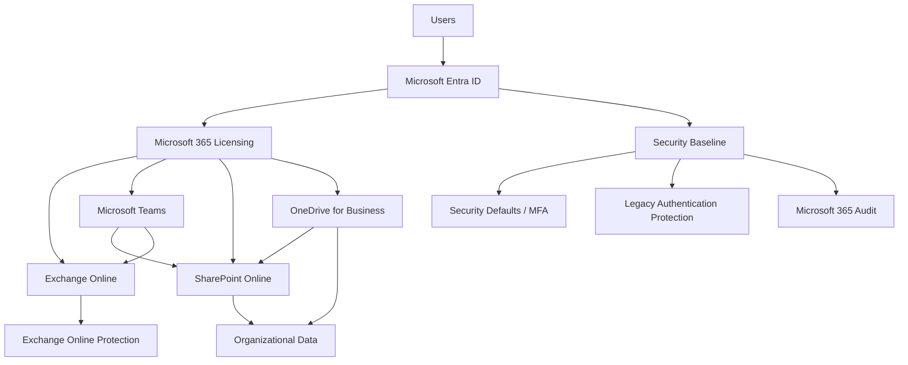
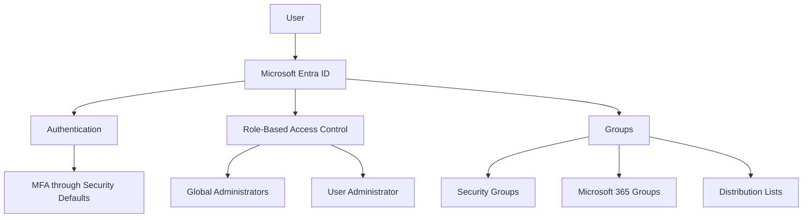
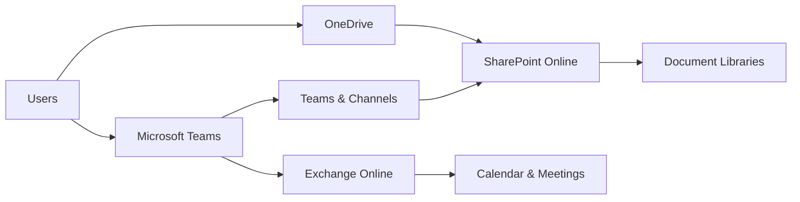
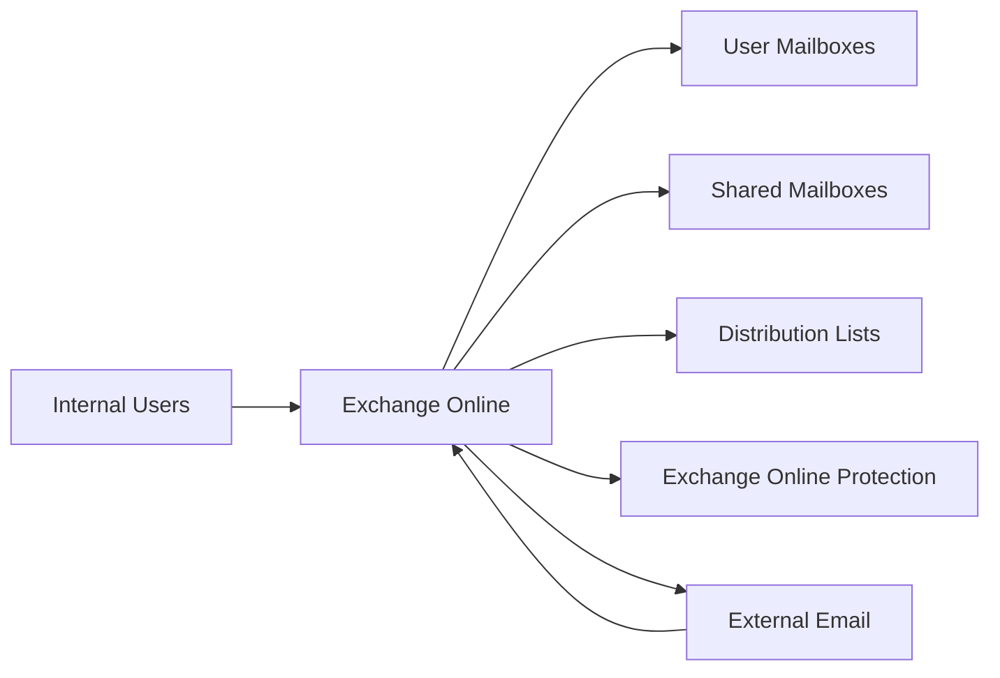
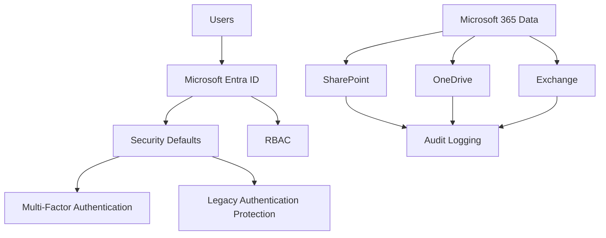
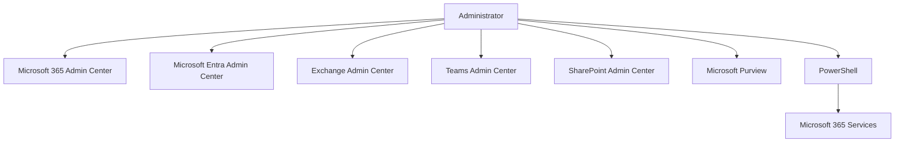
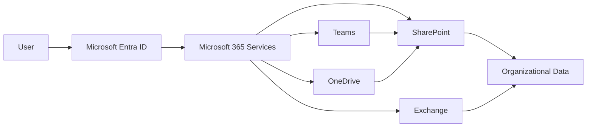
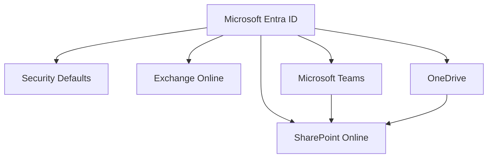
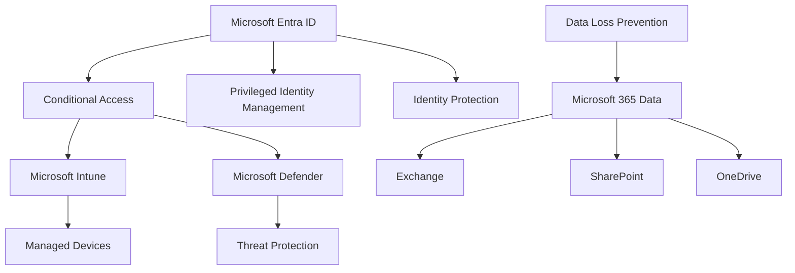

# Solution Architecture

---

# Overview

This document presents the final Microsoft 365 solution architecture implemented for **Probryx Technologies Ltd.**

It brings together the identity, licensing, messaging, collaboration, document management, and security components configured throughout the deployment.

---

# Architecture Objectives

* Document the overall Microsoft 365 architecture
* Show how Microsoft 365 services integrate
* Document identity and access flow
* Document collaboration and data flow
* Show security controls
* Provide a high-level reference architecture

---

# Enterprise Microsoft 365 Architecture

### Architecture Explanation

Microsoft Entra ID provides the identity foundation. Licensing enables Microsoft 365 workloads, while Exchange, Teams, SharePoint, and OneDrive provide communication, collaboration, and document management services.

Security Defaults provides the initial identity security layer, while Microsoft 365 security controls protect organizational data and services.

---

# Identity Architecture

### Explanation

Microsoft Entra ID manages users, authentication, groups, and administrative roles. Security Defaults provides baseline authentication protection.

---

# Collaboration Architecture

### Explanation

Teams provides collaboration and communication, while SharePoint stores Team files. OneDrive provides personal work storage, and Exchange Online provides email and calendar services.

---

# Messaging Architecture

### Explanation

Exchange Online provides organizational email services, including user mailboxes, shared mailboxes, distribution lists, and external mail flow.

---

# Security Architecture

### Explanation

Security Defaults provides the current baseline identity protection. RBAC controls administrative access, while audit logging provides visibility into Microsoft 365 activity.

Advanced Conditional Access and Zero Trust controls are reserved for Project 3.

---

# Administrative Architecture

### Explanation

Administrators can manage the environment through Microsoft 365 administrative portals or automate administrative tasks using PowerShell.

---

# Data Flow

### Explanation

Users authenticate through Microsoft Entra ID before accessing Microsoft 365 services. Collaboration data is primarily stored within Exchange Online, SharePoint Online, and OneDrive.

---

# Microsoft 365 Workload Summary

| Workload                | Primary Function        | Implementation |
| ----------------------- | ----------------------- | :------------: |
| Microsoft Entra ID      | Identity & Access       |        ✅       |
| Microsoft 365 Licensing | Service Licensing       |        ✅       |
| Exchange Online         | Email & Calendar        |        ✅       |
| Microsoft Teams         | Collaboration           |        ✅       |
| SharePoint Online       | Document Management     |        ✅       |
| OneDrive                | Personal Storage        |        ✅       |
| Security Defaults       | Baseline Security       |        ✅       |
| Audit Logging           | Monitoring              |        ✅       |
| Conditional Access      | Advanced Access Control |        ⏳       |

---

# Architecture Design Principles

### Identity-Centric

Microsoft Entra ID provides the central identity and authentication layer.

### Least Privilege

Administrative roles are assigned according to required responsibilities.

### Cloud-First

Microsoft 365 services provide cloud-based infrastructure without requiring traditional on-premises servers.

### Integrated Collaboration

Teams, SharePoint, OneDrive, and Exchange work together as an integrated collaboration platform.

### Security by Default

Security Defaults provides foundational identity protection while advanced security controls are planned for future implementation.

---

# Architecture Validation

| Validation            | Expected Result                  | Status |
| --------------------- | -------------------------------- | :----: |
| Identity Architecture | Entra ID configured              |    ✅   |
| Licensing             | Licenses assigned                |    ✅   |
| Exchange              | Mail flow operational            |    ✅   |
| Teams                 | Collaboration operational        |    ✅   |
| SharePoint            | Sites and libraries operational  |    ✅   |
| OneDrive              | User storage available           |    ✅   |
| Security              | Security Defaults enabled        |    ✅   |
| Audit                 | Microsoft 365 auditing available |    ✅   |
| Architecture          | Components integrated            |    ✅   |

### Screenshot

---

# Current Architecture vs Future State

## Current State

## Future State

The environment will be further secured and optimized through future projects.

### Future Architecture

The future state will introduce advanced Zero Trust security, endpoint management, threat protection, and data protection capabilities.

---

# Solution Architecture Summary

The Microsoft 365 environment provides:

* Centralized identity through Microsoft Entra ID
* Cloud-based email through Exchange Online
* Collaboration through Microsoft Teams
* Document management through SharePoint Online
* Personal work storage through OneDrive
* Baseline identity security through Security Defaults
* Centralized administration through Microsoft 365 portals
* PowerShell-based automation capabilities

The architecture provides a scalable foundation for future Microsoft Intune, Zero Trust, automation, and security projects.

---

# Conclusion

The Microsoft 365 solution architecture successfully integrates identity, licensing, communication, collaboration, document management, storage, and security into a unified cloud platform.

The architecture establishes the foundation for the organization's Microsoft 365 environment while allowing future projects to introduce advanced endpoint management, Zero Trust security, automation, and governance capabilities.

---

## Navigation

⬅️ Previous: [Security Baseline](../docs/09-Security-Baseline.md)

🏠 Project Home: [../README.md](../README.md)

➡️ Next: Enterprise Microsoft 365 PowerShell
